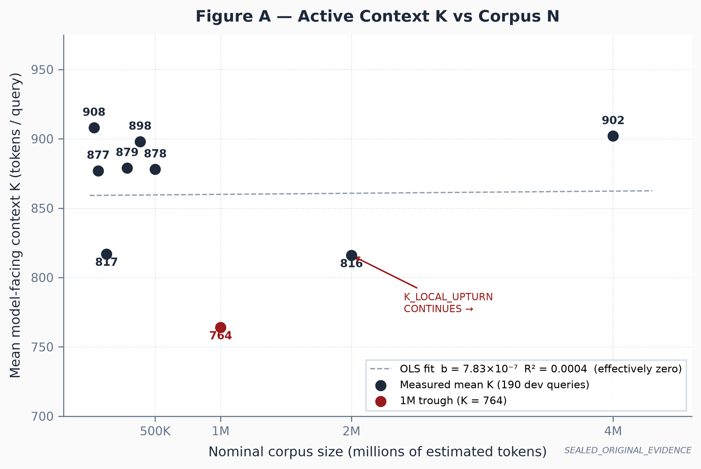
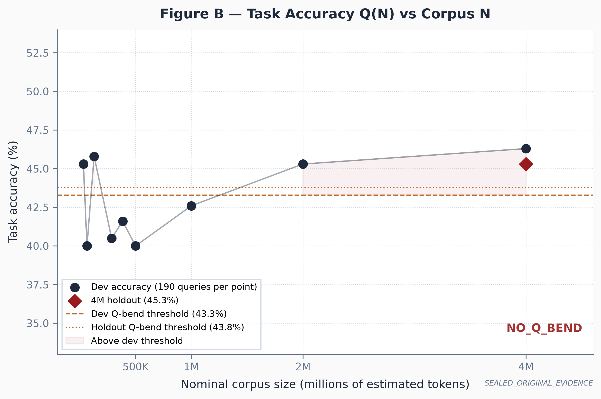
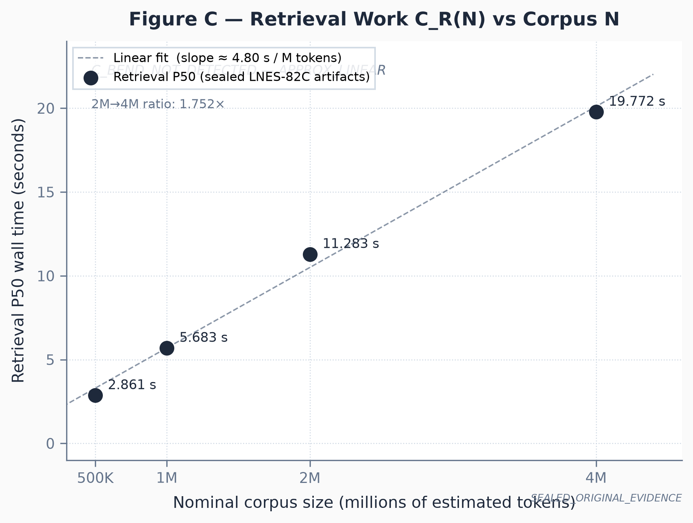
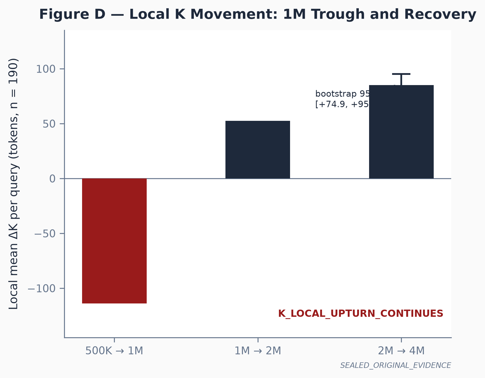
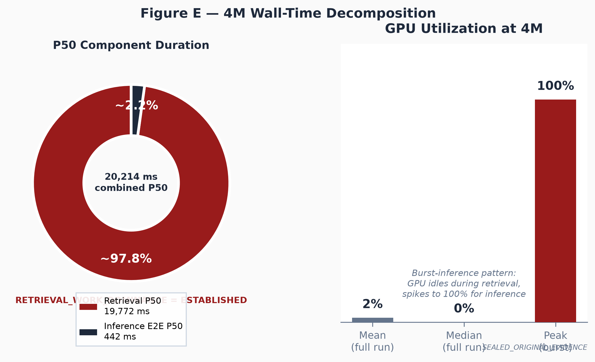

# xLMP and the AI Memory Control Plane

**Persistent State, Bounded Evidence, and Portable Memory
Beyond the Model Context Window — Digital and Physical**

A Technical White Paper

---

**Seven Ezumba**
Chief Architect and Corresponding Author
ExergyNet

---

August–September 2026
**Version 2.1 - Public Release Candidate (Sanitized)**
Public Classification: OPEN TECHNICAL REVIEW
Artifact Integrity: SHA-256 recorded in artifact manifest after source freeze.
Sanitization note: This version applies trade-secret-protection redactions per operator directive 2026-08-30. v2.1 extends v2.0 with a full paper-wide reconciliation to the sealed LNES-82C.4M 4M evidence state. Source v1.13 canonical is the internal record.

Canonical source: `exergynet/docs/whitepaper/AI_MEMORY_CONTROL_PLANE.md`
Claim Ledger: `exergynet/docs/whitepaper/CLAIM_LEDGER.md`
Evidence records: `exergynet/docs/whitepaper/evidence/README.md`
Maintenance policy: `exergynet/LWP_MAINTENANCE_POLICY.md`

---

## Publication Notice

This paper describes the architectural principles, category definition, and
design philosophy of xLMP, the ExergyNet Ledger Memory Protocol, and the
AI Memory Control Plane category. ExergyNet is referenced as the technology
and infrastructure platform described in this paper; application-specific
deployments and licensees are separate from the platform architecture unless
explicitly identified. Security-sensitive implementation details, private key
material, deployment credentials, internal infrastructure topology, and
proprietary resolver mechanics are excluded from this publication. Benchmark
data is drawn from signed, internally-verified deliverables identified in the
evidence directory. Performance claims identify their test conditions and
evidence identifiers. Individual claims are categorized in `CLAIM_LEDGER.md`.
This document does not constitute a financial prospectus or investment
solicitation. No Hopper/RISC Zero proving-path performance claim is made in
this edition; Hopper-based proving, Bonsai proving, and other accelerated
RISC Zero proving paths are excluded unless expressly identified in a cited
evidence record.

The companion paper to this publication is:
*LNES-22 and the Agent Authority Control Plane:
Cryptographic Delegation and Deterministic Authorization for Autonomous Systems*

The relationship between the two papers:

> xLMP governs the evidence available to an agent.
> LNES-22 governs consequential actions requested by that agent.

---

## Author Contributions

**Seven Ezumba:** Conceptualization; xLMP architecture; AI Memory Control Plane
category definition; ExergyNet systems architecture; physical-AI architecture;
NEURO-LOCK architecture; Atlas geospatial layer design; methodology; original
drafting; supervision; corresponding author.

**Bontu Veena:** Co-author. Independent validation of 10M corpus-scaling results and adjusted claims; review of Section 35.3.2 and manuscript scope boundaries; independent execution of selected public validation protocols including `exergynet-mcp-server@0.2.6` installation, npm-audit, MCP initialization, tool-discovery, and fail-closed settlement-path behavior; independent execution of the PIP-V0 reference test suite, producing 33 PASS / 0 FAIL including the eight negative tests and the `STATE_REALIZED ≠ AUTHORIZED` lifecycle invariant. Co-authorship cleared 2026-09-04.

Benchmark, systems-engineering, and review evidence from additional project
records is cited by evidence identifier where used.

---

## Independent External Validation

**Bontu Veena — Validation Scope.** Veena independently executed selected public validation protocols on a separate macOS environment. Her recorded results confirmed the tested MCP 0.2.6 package behavior and produced 33 PASS / 0 FAIL on the PIP-V0 reference implementation test suite. She additionally reviewed the 10M corpus-scaling holdout results (Section 35.6 and EVIDENCE_SEAL_LNES82C10M_HOLDOUT.md) and the manuscript's scope boundaries. MCP/PIP-V0 scope is separate from the LNES-82C A100 campaign design; co-authorship covers the validation and review work described above.

---

## Abstract

Autonomous AI systems have execution capability but lack the infrastructure
layer beneath it: persistent, portable, verifiable memory that survives models,
sessions, devices, and hardware generations. The model context window is working
memory. Applications that require durable state must reconstruct it at every
invocation, paying the full prefill cost each time, approaching context limits
as state accumulates, and losing continuity when models change. This is not a
limitation of any particular model. It is the architecture. There is no
persistent memory control plane beneath the model.

xLMP, the ExergyNet Ledger Memory Protocol, defines the missing layer. It
establishes the AI Memory Control Plane: the persistent systems layer that
governs which identified, bounded, provenance-bearing evidence enters an agent's
computation; where that state survives across models, devices, and accelerators;
and how evidence integrity, provenance, and authority are maintained as
independent properties.

The core architectural inversion xLMP introduces is:

> Computation attaches to persistent state.
> The model is temporary; the memory is primary.

In the LNES-59 procurement-state validation, model judgment accuracy remained
unchanged at 84 percent while false authoritative-state commitments fell from
8 percent to 0 percent. The result is a state-governance finding: the memory
control plane did not make the model smarter, but it prevented unresolved
evidence from being silently promoted into authoritative system state.

Measured on H200 infrastructure, xLMP kept prompt tokens at approximately
660-820 tokens as the corpus grew from 8k to 285k tokens, while full-context
injection grew from 11k to 67k tokens and was rejected outright past 262k.
xLMP delivered a mean accuracy improvement of 24.4 points over the tested RAG
implementation at equal evidence budget, and approximately 42.7x the
Useful-Answer-per-Token efficiency of full-context injection.

On A100 TP=4 infrastructure, a separate scaling campaign (LNES-82C) extended
xLMP validation across a nominal 32K-4M token corpus -- a 125x expansion.
Across nine corpus points, mean active staged context ranged from 764 to 908
tokens. The nine-point linear fit produced a slope effectively zero
(b = 7.83e-7, 95% CI includes zero, R^2 = 0.0004), with no detected material
positive global scaling of mean model-facing context as corpus grew 125x. A
statistically detectable local recovery from the 1M trough continued through 4M
(K_LOCAL_UPTURN_CONTINUES); aggregate accuracy did not degrade (4M holdout:
45.3%). Retrieval resolution work scaled approximately linearly with corpus size
and became the dominant wall-clock component at 4M -- retrieval P50 19.8 s
versus inference E2E P50 442 ms -- establishing retrieval-work efficiency as the
primary next scaling challenge in the frozen implementation. A subsequent genuine
10M holdout (5/5 deterministic runs, 312.5x corpus growth from 32K baseline)
confirmed K remained within the established 764-908 envelope (K_FLAT_OR_STABLE;
mean K=895.96). A retrieval-quality degradation was formally registered at 10M
adversarial corpus density: Q_BEND TRIGGERED at 39.5% accuracy (0.5pp below the
pre-registered 40.0% floor), driven by Q3 temporal authority and Q4 adversarial
ambiguity query classes; all inference calls returned status=ok. C_R(10M) is
hardware-confounded (WSL2/Windows, not A100) and is not an evidence-grade ratio.
These findings decompose corpus-scaling behavior across three independently
observable variables: K(N) (model-facing context), Q(N) (task accuracy), and
C_R(N) (retrieval/resolution work). That three-axis decomposition is a central
contribution of this paper (Section 35.7).

This architecture extends to physical systems. A conversational system can often
recover from a wrong response; an embodied system can convert stale memory,
poisoned evidence, or an unauthorized model output into kinetic damage. Physical
AI therefore requires persistent edge-local state, authenticated observations,
and a cryptographic boundary between model reasoning and physical actuation.
xLMP provides the persistent state substrate; NEURO-LOCK provides the actuation
boundary.

This paper establishes the AI Memory Control Plane as a new infrastructure
category, defines xLMP's technical architecture, presents the formal
computational model, describes both software and physical-AI applications, and
discloses the federally reviewed operating context in which the physical
actuation architecture has been exercised.

---

## Executive Summary

AI has a powerful execution layer. It lacks a persistent memory layer.

Current AI systems execute against temporary context. Sessions terminate.
Models are replaced. Every context window is working memory, not institutional
memory. Context injection, retrieval-augmented generation, and application-
specific memory databases are workarounds to an architectural absence: no
persistent memory control plane beneath the model governs what evidence enters
computation, verifies its integrity and provenance, and ensures continuity
across the lifetime of systems.

Larger context windows do not solve this problem. A larger working surface does
not create durable memory architecture.

xLMP addresses this at the infrastructure level:

- **Persistent memory objects:** content-addressed, cryptographically rooted,
  owned, and versioned knowledge units that survive model replacement, session
  termination, and hardware changes.
- **Bounded evidence staging:** complete, integrity-verified evidence drawn from
  identified objects, staged for model consumption without processing the entire
  corpus.
- **Model independence:** memory objects addressed by content roots, not by any
  model's embedding representation. Changing models does not invalidate existing
  memory.
- **Accelerator independence:** the memory control plane places no requirements
  on compute hardware. The interface is staged evidence, not the execution
  substrate.
- **Defined properties:** integrity, provenance, and authority as independent,
  separately verifiable properties.
- **Physical-AI actuation boundary:** through NEURO-LOCK, model outputs are
  recommendations; verified authorization objects are the authority.

xLMP does not replace GPUs, HBM, object storage, databases, or vector search.
GPUs and HBM provide active execution and working memory. xLMP provides
persistent state and control over what enters active computation. These are
distinct infrastructure roles. xLMP makes scarce execution infrastructure
productive for persistent application classes that temporary-context systems
cannot reliably support.

---

## Part I: The Memory Wall

### 1. Temporary Context and Stateless Execution

Every major AI inference system operating today executes against a temporary
context. The model receives tokens, produces tokens, and commits nothing
durable. Whatever knowledge the system appeared to possess during a session is
not retained when the session ends. The next session begins from the same
baseline state.

This is not a limitation of any particular model. It is the design. The
transformer model is a function: given a context, produce a continuation. It is
not a database, not a filing system, not an institution's persistent memory.

The practical pattern:

> At each invocation, inject the relevant prior state into the context.
> The model reasons over the injected state plus the new query.
> The response is returned. State is updated in an application-specific store.
> At the next invocation, the process repeats from the beginning.

This is polling. Each invocation polls the external state store, reconstructs
context, and begins fresh. Polling scales poorly: cost grows with state size,
latency grows with context size.

### 2. Why Larger Context Windows Are Not Persistent Memory

A context window is working memory. Persistent memory is institutional memory.
These are different things.

At large context sizes:

- A context of one million tokens populated with organizational history
  represents a full prefill cost at every invocation. As the organization
  accumulates more history, cost per invocation grows proportionally.
- Even with unlimited context capacity in principle, a real organization cannot
  place all of its knowledge into every context. Evidence selection is still
  required.
- Context windows are session-scoped. The state in a context window at session
  end does not automatically persist. It must be externalized, stored, and
  re-injected at the next session.

The key distinction: a context window determines how much information the model
can hold in working memory during a single task. A memory control plane
determines what information exists durably, who owns it, how it is retrieved
and staged, and how it survives the end of any given session.

### 3. Repeated Context Ingestion and the Data-Movement Problem

Let C be the total persistent corpus. In a fully stateless system:

- At each invocation, some fraction f(C) of the corpus is selected and injected.
- Prefill cost is proportional to the injected context: P(q) ∝ f(C).
- As C grows, f(C) may grow. Prefill cost grows correspondingly.

xLMP is designed to keep the model-facing evidence window bounded as the
persistent corpus grows. Storage, discovery, and governance costs may scale
with C. The model does not need to reprocess the complete corpus for every task.

### 4. Limits of RAG, Vector Search, and Application-Specific Memory

**RAG:** top-k retrieval selects the k most similar chunks to the query vector.
Similarity is not the same as relevance. Information distributed across a
document, requiring sequential context to interpret correctly, or relevant in
ways the similarity metric does not capture will be missing. The model reasons
over an incomplete evidence base without knowing it is incomplete.

**Vector databases:** useful discovery tools. They identify candidate documents
relevant to a query. They are not a memory control plane — they do not provide
completeness guarantees, integrity verification, provenance records, or
model-independent content addressing.

**Application-specific memory databases:** effective for specific applications.
Not portable, not model-independent. Knowledge accumulated with one model
provider is not portable to a different provider without export and reimport.

---

## Part II: Category Definition

### 5. The AI Memory Control Plane

The AI Memory Control Plane is the persistent systems layer that governs:

- which identified, bounded, provenance-bearing evidence enters an agent's computation;
- where that state survives across sessions, models, devices, and accelerators;
- who owns memory objects and under what conditions they may be shared;
- what the integrity status, provenance, and authority of stored knowledge is;
- when evidence is complete within its declared boundary versus partial;
- how memory attaches to and detaches from model execution.

The memory control plane is not a retrieval improvement, a RAG alternative, a
vector-search enhancement, a storage optimization, or a context-compression
technique. It is the persistent infrastructure layer beneath the model.

In the ExergyNet system architecture, this layer has distinct components:

| Component | Role |
|-----------|------|
| xLMP | Persistent memory protocol and control plane |
| VMN | Local developer memory node; open-source xLMP implementation |
| Omega Carrier | Cross-agent MCP toolset (Tools 1–5 deployed); cross-device memory transport architecture (designed) |
| Vanguard | Multi-model inference, bounded planning, review, and coordination over persistent state |
| LNES-22 | Deterministic authority gate for software consequential actions |
| NEURO-LOCK | Physical-actuation control boundary for autonomous machines |

GPUs and HBM serve active execution and working memory. xLMP governs what
enters that execution from persistent state. These are distinct infrastructure
roles.

```text
Persistent State (Total Corpus: C)
        │
        │  xLMP / AI Memory Control Plane
        ▼
Bounded Active Evidence E(q)
        │
        │  Tokenization / Model Runtime
        ▼
KV Cache / HBM
        │
        │  FlashAttention / Inference Kernels
        ▼
SRAM / Tensor Cores
        │
        ▼
Model Computation
```

xLMP governs movement from persistent state into active evidence.
FlashAttention and GPU inference kernels optimize movement and computation
after evidence has entered the model runtime. These layers operate on
different segments of the same pipeline and are complementary, not
competing: xLMP determines what reaches the runtime boundary; kernel-level
techniques determine how efficiently what has already crossed that boundary
is processed.

The central developer inversion:

> Applications own their persistent state. Models attach to that state temporarily.

### 6. Category Boundaries

xLMP is not RAG. xLMP is not a vector database. xLMP is not context
compression. xLMP is not a blockchain storage product. xLMP is not an MCP
plugin — VMN exposes its capabilities through MCP as an interface; the memory
control plane is the system behind it. xLMP is not an LLM.

### 7. What "Authoritative" Means: Three Properties

**Integrity:** the evidence matches its cryptographic commitment.
```
Content root → retrieved bytes = committed bytes.
```
Integrity alone does not establish that committed bytes represent true or
reliable information. It establishes content identity.

**Provenance:** the source, issuer, and transformation history of the evidence
are known and recorded.
```
Signed provenance record → source and transformation history.
```
Provenance alone does not establish authority. It establishes traceable origin.

**Authority:** a governing policy recognizes a specific source or object as
authoritative for a specified purpose, within a defined scope.
```
Policy + provenance → recognized decision status for a specified purpose.
```

The three properties form a complete chain:
```
Content root        →  integrity
Signed provenance   →  origin
Authority policy    →  recognized decision status
```

xLMP governs the first two directly. Authority policies are managed by the
application and, for consequential actions, by the companion LNES-22 authority
gate.

The correct description of what xLMP provides:

> xLMP governs which identified, bounded, provenance-bearing evidence enters
> an agent's computation, and verifies that the evidence matches its committed
> state.

### 8. First Principles of xLMP

1. Memory exists independently of the model. The model is a temporary execution engine that attaches to memory for the duration of a task.
2. Computation attaches to persistent state. Dormant state incurs no compute cost.
3. Stored state should not become active context without cause.
4. Evidence authority matters more than superficial similarity. Authoritative recall is bounded by the declared evidence unit and complete within it.
5. Discovery and authoritative recall are separate operations.
6. Integrity, provenance, and authority are separately verifiable properties. None implies the others.
7. Generated proof is not verified proof. A proof artifact produced by a prover is a candidate. Verification by an independent verifier confirms it.
8. State must survive model and hardware replacement. Memory objects are content-addressed, not embedding-addressed.
9. Agent knowledge and agent authority are separate control problems.
10. Memory efficiency should expand the number of viable applications.

### 9. Integrity, Provenance, and Authority in Practice

Integrity is established at ingest: content is processed to a stable canonical
form and committed with a cryptographic root. Any change to the content produces
a different root. An application can independently verify that a retrieved object
matches its root without trusting the storage system.

Provenance is established at ingest and updated at each transformation: origin
identifier, ingest timestamp, ingesting identity, and transformation history are
recorded.

Authority is policy-dependent and context-dependent. The memory control plane
does not make authority determinations. It provides the integrity and provenance
records that authority policies can evaluate.

### 9.1 Temporal Validity and Decision Lineage

The bottleneck in persistent AI is not storage capacity. It is state
governance. Autonomous systems require more than retained text or semantic
retrieval. They require reliable mechanisms for determining what information
remains authoritative, where it originated, when it was valid, who may
access it, when it must be superseded or forgotten, and which decisions it
influenced. The AI Memory Control Plane exists to govern this continuously
changing operational state independently of the model temporarily attached
to it.

This extends the three properties of Section 7 with two further dimensions
that matter once evidence is used to justify a decision or action:

**Temporal validity:** a fact recorded as authoritative at ingest is not
necessarily authoritative indefinitely. The control plane must be able to
represent when a fact became valid, whether it has been superseded, and
when it expires or must be forgotten — not only what the fact is.

**Decision lineage:** which evidence supported which interpretation, under
which policy state, producing which proposed action, receiving which
authorization, producing which observed outcome, and updating state to
what. A record that only says "this information was retrieved" is
insufficient for a system whose outputs have consequences; a system of
record for autonomous decisions needs the retrieval-to-outcome chain,
not only the retrieval step. Section 32.1 formalizes this chain as a
closed-loop validation sequence for physical action; the same lineage
requirement applies to any consequential software decision.

Retrieval answers what information is relevant. A memory control plane
determines what state is authoritative. RAG retrieves information for a
model. xLMP governs state for a system.

---

## Part III: Technical Architecture

### 10. Persistent Memory Objects

A memory object consists of:

- **Content:** the stored knowledge.
- **Root:** the cryptographic commitment to the canonical form of the content. Same canonical content, same root. Changed content, different root.
- **Metadata:** mutable owner-controlled attributes — title, tags, lifecycle state, access controls, timestamps. Separately rooted from content.
- **Manifest:** ordered record of evidence segments with cryptographic commitments, sufficient for independent integrity verification of any portion of the committed content.
- **Ownership:** the identity of the principal that controls the object.
- **Provenance record:** source identifier, ingest timestamp, ingesting identity, transformation history, lineage references.
- **Lifecycle state:** defined states (see Section 16).
- **Proof record:** current status of any cryptographic proof against this object's root.

Objects are immutable in their content. Updates produce new object versions with new roots.

### 11. Canonicalization, Roots, and Manifests

Before a root is computed, content is transformed to a canonical form. The
normalization procedure is version-tracked and recorded in the manifest. An
independent verifier that applies the same normalization procedure to the same
raw content will derive the same root without trusting the xLMP system.

The manifest records sufficient information for an independent verifier to:
- Verify the integrity of any individual evidence segment
- Verify the integrity of the complete committed content
- Confirm that the content matches its declared root
- Re-derive the root from the same canonical content

Specific manifest schema and segment boundary encoding are implementation details
governed by proprietary versioning and are not disclosed in this paper.

### 12. Discovery Versus Recall

**Discovery:** identifying candidate memory objects relevant to a query.
Uses structured search across stored objects using multiple search modalities,
including lexical, semantic, and metadata approaches. Output is a ranked list
of candidate roots. Approximate by design. Specific discovery algorithms are
implementation details not disclosed in this paper.
> Discovery answers: where should I look?

**Recall:** retrieving the complete, bounded evidence from a specific memory object.
Operates against a known root. Retrieves evidence segments with integrity
verification. Output is evidence, not a ranked list. Complete by design within
its declared boundary.
> Recall answers: what does this specific object say?

The completeness guarantee applies only to recall against a known root, not
to discovery output.

### 13. Evidence Units and Completeness Boundaries

Three recall modes, each with its own completeness guarantee:

**Object-complete recall:** returns the entire committed content of a memory
object. Every byte of committed content is present and integrity-verifiable.

**Record-complete recall:** returns an entire structured record or independently
meaningful unit within an object. Every field of the declared record type is
present.

**Range-bounded recall:** returns an exact committed byte range with segment
boundaries, offsets, and adjacent segment metadata. Every byte within the
declared range is present and integrity-verifiable.

Formal definition:

> Evidence completeness means that every byte, field, or record belonging to
> the declared evidence unit is present and integrity-verifiable. It does not
> mean that the selected unit contains every fact relevant to the broader question.

### 14. Bounded Evidence Staging

1. Discovery produces a ranked set of candidate roots.
2. The application selects roots from the discovery result based on priority and context-budget policies.
3. For each selected root, recall retrieves complete evidence within the chosen recall mode and declared boundary.
4. Recall output is assembled into the prompt context, with provenance labels identifying the source root and recall mode for each evidence block.
5. Dormant state — all memory not in the staged evidence — remains in storage, incurring no compute cost.

The evidence budget B is the maximum evidence volume that will be staged for a single model invocation. Every evidence block in the context is associated with a root the application can independently verify.

### 15. Model Attachment and Detachment

Attachment is temporary and task-scoped. A model session may discover, recall
bounded evidence, commit new objects, and update metadata. When the task
completes, the model session detaches. The memory objects persist independently
of the session. The next model to attach — different model, different hardware,
different application — attaches to the same objects via the same roots.

### 16. State Mutation and Versioning

```
INGESTED          Content committed, root computed, manifest recorded
ACTIVE            Object referenced and in regular use
AT_RISK           Shard availability below replication threshold
COLD              Not accessed within retention policy window
ARCHIVED          In long-term storage, retrieval latency increased
PROOF_REQUESTED   Cryptographic proof job submitted
PROOF_GENERATED   Proof artifact produced; awaiting independent verification
VERIFIED          Proof independently verified
REJECTED          Object failed integrity check or verification
```


### 16.1 The Determinism Divide: Learned Memory vs. Committed Memory

The AI Memory Control Plane distinguishes learned, rewritable model memory from
content-addressed, committed memory. Learned memory may be updated by training,
fine-tuning, cache eviction, preference learning, or prompt history. Committed
memory is different: it is identified, provenance-bearing state whose integrity
and authority can be checked outside the model. A later correction does not
silently overwrite the historical record. Committed memory is superseded, not
silently mutated.

This divide is why xLMP treats retrieval, state resolution, and authority as
system functions rather than as model impressions. The model may interpret
evidence; the memory control plane governs which evidence is in scope and
whether it is allowed to become authoritative state.
### 17. Access Control and Memory Namespaces

Namespaces: Personal, Organizational, Application, Public. Access control
operates at the object level: read, write, share, and delete permissions are
independently configurable.

### 18. Memory Transport and Synchronization

Memory objects are transportable. A memory object moved from one storage system
to another carries its root, manifest, provenance record, and lifecycle state.
The receiving system can independently verify the object's integrity against
its root without trusting the transport path.

---

## Part IV: Developer Infrastructure

### 19. The Application Lifecycle with xLMP

General developers can create applications whose state persists independently
of the model executing the current task. In software systems, this enables
long-running personal, enterprise, clinical, and research agents. In physical
systems, it enables machines whose mission state survives power cycles,
connectivity loss, model replacement, and infrastructure migration.

The central developer inversion: **applications own their persistent state.
Models attach to that state temporarily.**

Application lifecycle:

```
Create persistent memory namespace
        ↓
Commit memory objects
        ↓
Attach authorized model session
        ↓
Discover candidate state
        ↓
Recall bounded evidence
        ↓
Perform computation
        ↓
Commit resulting state
        ↓
Detach model
        ↓
Attach another model or system later
```

Developer interface:

```
memory.namespace("organization")
memory.commit(content, metadata)
memory.discover(query)
memory.recall(root, mode)
memory.share(root, identity)
memory.verify(root)
```

Physical AI is one application class of this larger developer primitive. The
same API, protocol, and memory objects that serve a software agent accumulate
mission memory for a physical machine.

### 20. VMN: Local Persistent Memory

The Vanguard Memory Node is the open-source local implementation of the xLMP
memory architecture. VMN provides:

- Local ingest: storing content as xLMP memory objects with cryptographic content roots and local manifest generation.
- Persistent storage: content-addressed storage surviving session termination, application restart, and system reboots.
- Discovery: lexical and structured search over stored objects.
- Root-bound recall: complete bounded evidence with segment-level integrity verification.
- MCP integration: compatibility with Claude Code and MCP-aware applications.

VMN explicitly does not provide: distributed storage, on-chain proof
verification, or production resolver capabilities.

**VMN Engineering Findings:**
- Content-boundary fragmentation corrected in v1.1 by boundary-aware detection.
- Discovery index matching accuracy corrected in v1.1 to handle morphological variation.
- Index throughput bottleneck at large object counts; addressed in v1.2 (superseded by v2.0 adaptive path — see status below).
- A candidate index-based retrieval structure was evaluated locally as a replacement for xLMP's current retrieval path and did not outperform it at the tested LNES-59 procurement-corpus scale (20—164 documents). At small-to-medium procurement corpus scale, the current path is faster because the indexed approach pays fixed overhead that dominates any theoretical lookup advantage. This remains an open large-scale research question, not a validated advancement — untested at corpus scales where an indexed lookup's theoretical advantage might begin to outweigh that fixed overhead.
- **Current status (v2.0):** VMN is published as `@lnes/vanguard-memory-node@2.0.0` (npm, public), source-synchronized to its GitHub repository. It now provides adaptive deterministic retrieval — a workload-aware retrieval path that can change strategy when the active path's assumptions stop holding for a given query — validated with 34/34 regression tests passing (30 original plus 4 exercising the adaptive path) and zero observed regressions against the prior release. This supersedes the "v1.2 sharded incremental index architecture (in development)" line above, which is retained here as historical record of the earlier engineering finding, not as current status. The internal decision mechanics of the adaptive path are a trade-secret-controlled implementation detail and are not disclosed in this paper; see Section 20.1 below for the retrieval-benchmark family this connects to.

#### 20.1 LNES-84: Compact/Deterministic Index Retrieval Benchmark

A separate, sealed benchmark line (LNES-84) evaluated a compact,
deterministic candidate-index structure as a replacement for VMN's
linear-scan evidence retrieval, independent of the LNES-86 adaptive-routing
work described in Section 20.2. **The verdict is workload-dependent, not
uniformly positive, and is stated as such deliberately** — the correctness
and robustness side of this system is validated without qualification;
the performance side is not.

**Correctness and robustness:** validated in the sealed LNES-84 test suite with zero observed
failures across concurrent-reader tests (concurrency 1 through 16),
mutation-generation consistency, index-corruption detection, crash/restart
recovery, and authority-boundary negative tests.

**Performance:** the effect is real but depends heavily on workload shape.
On a narrow, single-scale 1GB / 100-query population where the linear-scan
baseline pays a large, constant per-query cost, the indexed approach showed
a large observed advantage — median paired speedup 52,753.8x (bootstrap 95%
CI [42,014x, 56,537x]), faster on 100 of 100 queries, alongside a measured
accuracy improvement from 87% to 94% under a corrected symmetric scoring
rule (+7 percentage points, p = 0.039). On a later, more realistic 10MB
vault built with a **mixed** document-size composition (231 real paired
queries — 84% small/entity documents, 16% large/filler documents), the
aggregate **median** speedup was 0.72x: the indexed approach was slower
than the linear-scan baseline on the median query, because its fixed
per-call construction overhead is not amortized when most queries touch
small documents. Only the large-document slice of that realistic mix
(16% of queries) showed the indexed approach faster (2.28x median).
Vault-level behavior at 1GB scale has not been empirically re-measured
under this more realistic, mixed-composition methodology.

No claim of universal O(1) retrieval, or of universal speedup, is made.
The honest summary is: correctness and robustness are validated; whether
the indexed approach helps depends on the shape of the workload it is
applied to, and the shape matters more than the accelerator or the raw
corpus size.

#### 20.2 LNES-86: Adaptive Workload-Aware Retrieval Routing

ExergyNet's local retrieval stack (VMN v2.0, Section 20) uses workload-aware
retrieval that can adapt when the active retrieval path loses its
efficiency advantage for a given query, rather than committing to a single
fixed strategy or predicting the right strategy in advance. Within the
tested workload (the frozen LNES-86 benchmark population), this measured
approximately 1.92x throughput versus a legacy always-full-scan baseline
and approximately 1.13x versus a static compact-index-only baseline, with
decision behavior validated against a sealed 6-way holdout comparison,
concurrency testing (1 through 16), mutation/restart handling, and failure
injection. These figures describe behavior within the tested workload only
and are not presented as a general-purpose multiplier. The specific
mechanism by which the system detects when to adapt is a trade-secret
implementation detail and is not disclosed in this paper.

### 21. Omega Carrier: Cross-Agent Toolset and Cross-Device Continuity

Omega Carrier has two distinct aspects with different implementation states:

**Deployed: Cross-Agent MCP Toolset (Tools 1–5, SSE port 8765)**
Omega Carrier Tools 1–5 are a real deployed MCP toolset for visiting AI agents,
operational on port 8765. They provide AI agents with access to Exergy Vault
capabilities including evidence recall, vault commit, and Rho economic
operations. Tool 6 (`strike_rho_recursion`) has a HITL gate now deployed;
the siphon swap signal remains not fully wired. (EVD-008)

**Designed: Cross-Device xLMP Memory Transport**
The broader Omega Carrier memory transport architecture — moving xLMP objects
between devices (laptop VMN → workstation VMN → field node) with root and
provenance preservation — is designed and documented. It is distinct from the
deployed MCP toolset and is not yet operationally deployed.

**Note on naming:** "Omega Carrier" in this paper refers to both the deployed
MCP toolset and the designed cross-device transport layer. These are different
systems sharing a name. The status table in Section 32 distinguishes them.

### 22. Cross-Model Applications

Example: an autonomous software development system.

```
Claude plans       →  commits planning output to xLMP
Coding model       →  retrieves planning output; commits implementation
Local model        →  analyzes committed implementation using private context
                      without sharing with external model providers
```

All three models attach to the same persistent memory namespace. None of them
owns the memory. The application owns the memory. Any model can be replaced
without losing the project's state.

### 23. Cross-Device Applications

A personal AI system accumulating genuine knowledge across years:

```
Laptop:   morning planning session, using personal VMN namespace
Mobile:   midday query answered by local model, adding a memory object
Tablet:   evening research, drawing on accumulated context
          ↓
      Omega Carrier cross-device transport synchronizes
```

### 24. Enterprise Institutional Memory

Organizations commit documents, decisions, and processes to an xLMP namespace.
Authorized model sessions retrieve bounded evidence. When employees leave,
their contributions remain. When the organization changes model providers, the
memory objects remain and the new model attaches to the same roots.

### 25. Long-Running Autonomous Systems

A long-running agent with xLMP accumulates knowledge continuously, builds on
accumulated knowledge without full context reconstruction at each invocation,
survives model replacement without losing accumulated knowledge, and maintains
a complete integrity-verified record of what it has done and decided.

An autonomous machine in intermittent-connectivity conditions holds xLMP objects
locally, uses them for real-time decisions, and synchronizes when connectivity
allows. Mission context survives power cycles and connectivity gaps.

---

## Part V: Beyond Silicon — Persistent State and Cryptographic Actuation for Physical AI

Physical AI systems represent the highest-stakes application class for
persistent memory. A conversational AI system can often recover from a wrong
response. An embodied system — a machine with motors, actuators, rotors,
sensors, and kinetic consequence — can convert stale memory, poisoned evidence,
an incorrect coordinate, or an unauthorized model output into physical damage.

The demands of physical AI are therefore more stringent than those of software
agents. The machine needs persistent edge-local state that survives connectivity
loss and model replacement. It needs authenticated, integrity-bound
observations. It needs a cryptographic boundary between model reasoning and
physical actuation that no amount of persuasive model output can cross.

xLMP provides the persistent state substrate. NEURO-LOCK provides the actuation
boundary.

This section documents architecture and disclosed design. Where implementation
status differs from architecture, current status is stated explicitly. The
Physical AI Status Table in Section 32 states the complete per-subsystem status
across multiple dimensions.

### 26. The Kinetic Consequence of the Memory Wall

The temporary context limitation is an inconvenience in conversational systems.
In physical systems, it is a safety concern.

A physical AI system — an autonomous aircraft, a ground vehicle, a heavy-lift
machine — requires across the duration of an extended mission:

- **Mission history:** what routes have been operated, what tasks completed, what obstacles recorded.
- **Maintenance state:** airframe hours, component-level wear, inspection records, scheduled maintenance actions.
- **Geospatial constraints:** restricted airspace, terrain data, obstacle maps, corridor authorizations.
- **Prior sensor observations:** what sensors observed on prior passes of a location, how those observations have changed.
- **Operator directives:** standing rules of engagement, mission-specific instructions, changes issued during earlier mission phases.
- **Aircraft configuration:** current payload, energy state, sensor suite status.
- **Safety state:** fault history, current warning conditions, actions taken in response to prior anomalies.
- **Persistent operating policies:** regulations, operator-issued constraints, airspace authority requirements, emergency procedures.

A model executing against a freshly reconstructed context from these categories
is managing a reconstruction problem at every invocation. A mission that spans
hours or days, with intermittent connectivity to cloud infrastructure, cannot
reliably perform this reconstruction. The machine's durable memory must survive
model replacement, connectivity loss, device restart, and cloud-provider changes.

The physical AI memory problem is a mission continuity and safety architecture
requirement.

### 26.1 Trust Infrastructure for Physical Autonomy

Physical autonomy cannot scale solely through improvements in perception,
navigation, or model intelligence. It also requires a persistent trust layer
capable of preserving authoritative mission state, constraining actions under
explicit policy, recording physical execution, and reconciling verified
outcomes.

ExergyNet is designed as infrastructure independent of any single airframe,
model, sensor package, or flight controller. xLMP governs persistent state
and bounded evidence. LNES-22 governs software authority. NEURO-LOCK governs
controlled physical actuation. Edge Witnesses provide signed evidence of
environmental and operational outcomes.

This separation allows an autonomous aircraft, ground vehicle, maritime
system, industrial robot, or future physical agent to attach to the same
trust architecture without requiring the intelligence and governance layers
to be rebuilt for each machine.

The long-term opportunity is therefore not limited to operating one
autonomous platform. It is to provide the persistent state, authorization,
execution, and verification infrastructure through which many physical
systems can be trusted, audited, insured, and governed.

### 27. xLMP as Persistent Mission Memory

xLMP maintains model-independent mission state while ensuring that only bounded
evidence enters active computation.

> The flight session is temporary. The aircraft's mission memory is not.

A model that attaches to the aircraft's xLMP namespace for a planning or
perception task retrieves bounded evidence from mission objects — the relevant
portions of the mission history, the applicable geospatial constraints, the
current safety state. It does not reconstruct the entire mission context from
scratch. When the model session ends, the mission objects persist. The next
model to attach, on whatever hardware is available, attaches to the same roots.

xLMP does not imply that a model controls the vehicle directly. The persistent
memory layer governs evidence. The actuation control architecture governs
physical action. These are distinct.

### 28. Atlas: Deterministic Geospatial Routing and Sovereign Spatial State

Physical AI systems that navigate cannot depend exclusively on external map
APIs, unverified coordinates, or spoofable positioning inputs.

Atlas is ExergyNet's deterministic geospatial routing and spatial-graph layer
architecture. It is designed to provide:

- **Deterministic routing:** path computation over governed spatial graphs producing consistent, auditable results from the same inputs.
- **Sovereign spatial graphs:** geospatial data committed to xLMP objects with content roots, provenance records, and versioned manifests. A connectivity gap does not remove spatial context.
- **Versioned map state:** updates produce new object versions with new roots; the vehicle knows which version of the spatial graph it operates against.
- **Geofence and corridor enforcement:** routes outside the authorized corridor are rejected at the Atlas layer.

**Current status:** Atlas is DESIGNED. No deployed routing engine was found in
the project record during the review of this paper. The Edge Witness app
contains a geospatial map view (Leaflet, `s-streets` screen) for observation
drops; this is a frontend display layer, not the Atlas routing engine.

**Taxonomy note:** Atlas provides routing over governed spatial graphs. It does
not provide positioning independent of GPS. Positioning independent of GPS
infrastructure is a separate architecture problem. A LNES number for that
system has not yet been assigned in the project record. (See Section 28.1.)

#### 28.1 GPS-Independent Positioning [LNES number reserved for future assignment]

A physical AI system that relies exclusively on GPS satellite infrastructure for
its position estimate is dependent on a single, spoofable, jammable signal
source. A GPS-independent positioning and ranging layer — operating through
mesh-network ranging, acoustic ranging, inertial fusion, or other means — is a
design requirement for certain physical AI operating environments.

No ExergyNet LNES number has been confirmed in the project record for this
system. **LNES-11 is occupied:** a deployed bilateral consensus component on AskMo
uses LNES-11 as its protocol identifier, providing independent second-opinion
review of high-stakes model decisions.
(Evidence: EVD-006 — `deployed-snapshots/README.md`.) Using LNES-11 for
GPS-independent positioning in this paper would create a numbering collision
with a live deployed system. A LNES number for the positioning layer must be
assigned separately before it appears in any publication.

**Current status:** DESIGNED (no project-record evidence of implementation).
LNES number: TO BE ASSIGNED by operator. GPS-independent positioning is
referenced in this paper as a design requirement, not as a deployed or
implemented capability.

### 29. LNES-06 and LNES-12: Physical Observation and Communications

#### 29.1 LNES-06 Edge Witness: Hardware-Attested Physical Observation Platform

LNES-06 Edge Witness is a deployed Android application (v2.22.8, versionCode
247, package `com.exergynet.myapplication`) providing a field observation and
sensing platform. (Evidence: EVD-005)

The app is a native Android shell with a WebView-first UI. The native Kotlin
layer provides:
- Multi-modal sensor access: GPS, NFC, BLE, optical (camera), acoustic (ASSA),
  cellular (AREM)
- Cryptographic primitives
- Network transports (LAN, BLE, P2P, LiveKit SFU)
- A JavaScript bridge (`window.ExergyKinesis`, 96+ methods)

In the context of physical AI, LNES-06 provides the field observation layer:
sensor data authenticated to a known device identity and timestamped at
capture. Observations can be committed to xLMP objects as authenticated,
integrity-bound records.

**Current status (EVD-005):**

| Layer | Status |
|-------|--------|
| Android platform delivery | DEPLOYED (APK distributed via Carrier EC2) |
| Sensor access (GPS, NFC, BLE, optical, acoustic, cellular) | DEPLOYED |
| LiveKit SFU calling (cross-network video) | DEPLOYED |
| xLMP integration (observations committed to Exergy Vault) | STAGED |

#### 29.2 LNES-12: Acoustic Signaling and WebRTC Calling Layer

LNES-12 is the deployed real-time communications infrastructure:
LiveKit SFU and coturn on a dedicated EC2 instance. Cross-network video
calling is confirmed. The TURN relay path has been hardened through a series
of documented fixes (LNES-12.1 through LNES-12.8, in `LNES12_CHANGE_LOG.md`).
(Evidence: EVD-007)

In the context of physical AI, LNES-12 provides the real-time communications
layer over which observations, operator commands, and mission data move between
field devices and infrastructure when WebRTC connectivity is available.

**Note on public description:** This paper previously described LNES-12 as a
"designed Global Media Mesh." That description was incorrect. LNES-12 is a
deployed LiveKit/coturn WebRTC communications infrastructure. The public paper
describes it as the communications layer for physical AI coordination; detailed
operational configuration is internal only.

**Current status (EVD-007):**

| Layer | Status |
|-------|--------|
| LiveKit SFU (Carrier EC2) | DEPLOYED — 18+ days uptime confirmed |
| coturn TURN relay | DEPLOYED — ports 3478/5349/relay range |
| Cross-network WebRTC calls | DEPLOYED — confirmed |
| Durable mesh relay (non-WebRTC fallback) | DESIGNED |

### 30. NEURO-LOCK: Cryptographic Actuation Boundary

The separation between model reasoning and physical actuation is the most
critical control boundary in a physical AI system.

NEURO-LOCK is the sovereign operating system and actuation-control architecture
of Bolt, ExergyNet's heavy-lift uncrewed aerial vehicle. NEURO-LOCK enforces
the boundary between model reasoning and physical action.

**The model may:**
- Analyze sensor data and mission state
- Recommend a course of action
- Plan a route or task sequence
- Request a specific physical action through the authorized request channel

**The model may not directly:**
- Actuate a motor or control surface
- Change flight-critical configuration
- Release a payload
- Alter a protected route
- Override a safety state
- Execute an unrestricted command

The actuation rule:

> A model output is a recommendation. A verified authorization object is the authority.

The intended authorization chain for a physical action:

```
xLMP evidence root
    ↓
authorized identity (operator or trustee with signing capability)
    ↓
typed capability (specific, declared action class)
    ↓
exact resource and argument commitment (target, parameters)
    ↓
policy evaluation (does the request fit the authorized scope?)
    ↓
required human or trustee approval (where policy demands it)
    ↓
NEURO-LOCK actuation decision
    ↓
signed execution record (what was done, when, by which authorization)
```

This chain ensures that natural language in retrieved memory — however
authoritatively it appears — has zero authority to authorize a physical action.

#### 30.1 FAA Operating Context

NEURO-LOCK was disclosed to the Federal Aviation Administration as the
operating-system and control architecture of KTX's VSG HL 01 "Bolt" during the
agency's review of the aircraft, petition, and associated operating
documentation. Bolt subsequently received FAA Exemption No. 26214, Regulatory
Docket No. FAA-2025-5731, authorizing defined UAS lift operations, evaluation,
testing, and demonstration at a maximum takeoff weight of 275 pounds, subject
to the exemption, the applicable Certificate of Waiver or Authorization, and
the FAA-reviewed operating procedures. This places NEURO-LOCK within a
federally reviewed heavy-lift UAS operating context rather than presenting it
solely as a conceptual physical-AI architecture.

xLMP extends this control architecture by providing persistent, integrity-rooted
mission memory that can survive changes in model, device, network, and
accelerator.

**FAA Claim Boundary Note:** This paper states that: the FAA was aware of
NEURO-LOCK; it appeared in the reviewed operating documentation; it was
presented as Bolt's operating-system or control architecture; Bolt received
Exemption No. 26214; the authorized maximum takeoff weight is 275 pounds;
and the exemption creates a federally governed heavy-lift operating environment.
This paper does not claim: "FAA-certified NEURO-LOCK," "FAA-certified xLMP,"
FAA endorsement of ExergyNet, or FAA formal validation of every NEURO-LOCK
security property. If the precise FAA submission language for NEURO-LOCK is
obtained from the public docket record (FAA-2025-5731), that language will be
quoted or paraphrased accurately in a source note at that time.

#### 30.2 NEURO-LOCK Current Status

The full authorization chain (Section 30) represents the target architecture.

| Status Dimension | Current State |
|-----------------|---------------|
| IMPLEMENTATION_STATUS | DESIGNED (full authorization chain); policy evaluation module STAGED |
| FAA_DISCLOSURE_STATUS | DISCLOSED_IN_OPERATING_DOCUMENTATION (Docket FAA-2025-5731) |
| REGULATORY_PLATFORM_STATUS | BOLT_EXEMPTION_GRANTED (Exemption No. 26214, MTOW 275 lbs) |
| FAA_TECHNICAL_ENDORSEMENT | NOT_CLAIMED |
| PRODUCTION_ACTUATION_STATUS | NOT_CLAIMED (full chain not operationally deployed) |

### 31. Physical AI and the Developer Primitive

Physical AI extends the same xLMP developer primitive that software agents use.
The same protocol and memory objects serve both.

| Component | Physical AI Role |
|-----------|-----------------|
| VMN | Local state node on the aircraft, ground station, or field device |
| Omega Carrier (cross-device) | Synchronizes mission state between edge nodes and central infrastructure when connectivity allows |
| xLMP | Persistent memory protocol: mission history, observations, constraints, directives as content-rooted integrity-verified objects |
| LNES-22 | Authority gate for software consequential actions that support the mission |
| NEURO-LOCK | Physical actuation boundary |

The developer who builds an enterprise knowledge agent and the engineer who
builds mission memory for an autonomous aircraft use the same protocol. The
difference is the consequence class of the actions downstream of that memory.

### 32. Physical AI Status Table

The following table states the verified status of each physical AI subsystem
across multiple independent dimensions. "FAA-reviewed" is a disclosure
dimension; it does not substitute for implementation or production-actuation
status.

---

**SUBSYSTEM: xLMP**
ROLE: Persistent memory protocol and control plane
IMPLEMENTATION_STATUS: DEPLOYED (VMN local, Exergy Vault); STAGED (production resolver)
VALIDATION_STATUS: H200 benchmark (EVD-001, EVD-002): prompt tokens 660-820 flat, +24.4 accuracy vs RAG, 42.7x token efficiency vs full-context. A100 LNES-82C N->K ladder (32K-4M): K=764-908 across tested envelope; no detected positive global scaling (b=7.83e-7, t=0.055); K_LOCAL_UPTURN_CONTINUES at 4M; NO_Q_BEND at 4M; C_BEND_NOT_DETECTED; RETRIEVAL_WORK_DOMINANCE=ESTABLISHED at 4M. 10M holdout extension (WSL2/Windows): K_FLAT_OR_STABLE (mean K=895.96 within 764-908 envelope); Q_BEND TRIGGERED at 39.5% (0.5pp below 40% floor; Q3/Q4 adversarial density); C_R(10M) hardware-confounded (see Section 35.6-35.7)
DEPLOYMENT_STATUS: DEPLOYED (VMN local); STAGED (enterprise resolver)
PUBLIC_CLAIM_STATUS: Full architecture claimed; benchmark companion in preparation
EVIDENCE_REFERENCE: EVD-001, EVD-002

---

**SUBSYSTEM: VMN (Vanguard Memory Node)**
ROLE: Local developer memory node; open-source xLMP implementation
IMPLEMENTATION_STATUS: DEPLOYED (v2.0.0, npm-published as `@lnes/vanguard-memory-node`)
VALIDATION_STATUS: Ingest, retrieval, root-bound recall, MCP integration tested; 34/34 regression tests passing on v2.0.0 (Section 20)
DEPLOYMENT_STATUS: DEPLOYED (production local instances; source synchronized to GitHub)
PUBLIC_CLAIM_STATUS: Full capabilities as described in Section 20; adaptive deterministic retrieval enabled (mechanism not disclosed — trade secret)
EVIDENCE_REFERENCE: Direct system operation; npm registry + GitHub release provenance

---

**SUBSYSTEM: Omega Carrier (MCP Toolset, Tools 1–5)**
ROLE: Cross-agent MCP toolset for visiting AI agents; SSE port 8765
IMPLEMENTATION_STATUS: DEPLOYED
VALIDATION_STATUS: Tools 1–5 REAL; Tool 6 HITL gate deployed 2026-08-01; siphon swap signal not wired
DEPLOYMENT_STATUS: DEPLOYED (Tools 1–5); STAGED (Tool 6 full path)
PUBLIC_CLAIM_STATUS: MCP toolset described as deployed; cross-device transport architecture described as designed (Section 21)
EVIDENCE_REFERENCE: EVD-008

---

**SUBSYSTEM: Omega Carrier (Cross-Device Memory Transport)**
ROLE: Cross-device and cross-system xLMP object transport
IMPLEMENTATION_STATUS: DESIGNED
VALIDATION_STATUS: Architecture documented; not yet in system test
DEPLOYMENT_STATUS: PLANNED
PUBLIC_CLAIM_STATUS: Architecture described; no operational claim
EVIDENCE_REFERENCE: EVD-008

---

**SUBSYSTEM: Vanguard**
ROLE: Multi-model inference, bounded planning, review, and coordination over persistent state
IMPLEMENTATION_STATUS: DEPLOYED (multi-model router on AskMo)
VALIDATION_STATUS: Live-tested — inference restored, tool execution verified, LNES-11 bilateral consensus operational
DEPLOYMENT_STATUS: DEPLOYED
PUBLIC_CLAIM_STATUS: Routing and inference capabilities claimed as deployed
EVIDENCE_REFERENCE: EVD-006; live system test August 2026

---

**SUBSYSTEM: Atlas**
ROLE: Deterministic geospatial routing; sovereign spatial graph layer
IMPLEMENTATION_STATUS: DESIGNED
VALIDATION_STATUS: No deployed routing engine found in project record; Leaflet map view in LNES-06 is a display layer, not Atlas
DEPLOYMENT_STATUS: PLANNED
PUBLIC_CLAIM_STATUS: Architecture described; no operational claim; deployed vs. designed distinction explicit in text
EVIDENCE_REFERENCE: Project record review; absence of deployed engine is the evidence

---

**SUBSYSTEM: GPS-Independent Positioning [LNES number reserved for future assignment]**
ROLE: Positioning and ranging independent of GPS satellite infrastructure
IMPLEMENTATION_STATUS: DESIGNED
VALIDATION_STATUS: Not yet in system test
DEPLOYMENT_STATUS: PLANNED
PUBLIC_CLAIM_STATUS: Design requirement stated; no LNES number assigned; LNES-11 is occupied by bilateral consensus (EVD-006)
EVIDENCE_REFERENCE: EVD-006 (confirms LNES-11 occupation)

---

**SUBSYSTEM: LNES-11 (Bilateral Consensus)**
ROLE: Independent bilateral second-opinion review
IMPLEMENTATION_STATUS: DEPLOYED on AskMo
VALIDATION_STATUS: Operational on AskMo
DEPLOYMENT_STATUS: DEPLOYED
PUBLIC_CLAIM_STATUS: Not a physical AI subsystem; LNES-11 is a software AI reasoning control component
EVIDENCE_REFERENCE: EVD-006

---

**SUBSYSTEM: LNES-06 Edge Witness**
ROLE: Field observation and sensing Android platform; physical-world data collection
IMPLEMENTATION_STATUS: DEPLOYED (v2.22.8 versionCode 247)
VALIDATION_STATUS: APK deployed; GPS, NFC, BLE, optical, acoustic, cellular, LiveKit SFU tested
DEPLOYMENT_STATUS: DEPLOYED (APK); STAGED (xLMP vault integration)
PUBLIC_CLAIM_STATUS: Field sensing platform described; operational APK claimed; vault integration claimed as staged
EVIDENCE_REFERENCE: EVD-005

---

**SUBSYSTEM: LNES-12 Acoustic Signaling / WebRTC Layer**
ROLE: Real-time communications infrastructure: LiveKit SFU + coturn on Carrier EC2
IMPLEMENTATION_STATUS: DEPLOYED
VALIDATION_STATUS: Cross-network video calls confirmed; TURN relay hardened through LNES-12.1–12.8
DEPLOYMENT_STATUS: DEPLOYED
PUBLIC_CLAIM_STATUS: Communications layer for physical AI coordination described; operational status as deployed infrastructure claimed
EVIDENCE_REFERENCE: EVD-007

---

**SUBSYSTEM: LNES-22**
ROLE: Deterministic authority gate for software consequential actions
IMPLEMENTATION_STATUS: STAGED - mixed deployed and designed components; see breakdown below
VALIDATION_STATUS: Live adversarial test, August 2026; rejection logging validated
DEPLOYMENT_STATUS: STAGED (multiple components; see breakdown)
PUBLIC_CLAIM_STATUS: Per-component status explicit in table below
EVIDENCE_REFERENCE: EVD-004

LNES-22 component breakdown:

| Component | Status |
|-----------|--------|
| Ed25519 review signing (VANGUARD-01) | DEPLOYED — restored 2026-08-05 |
| Sensory-trigger webhook from agent-edit | DEPLOYED — restored 2026-08-05 |
| POST /api/admin/build/vanguard-review receiver | DEPLOYED — restored 2026-08-05 |
| Schema validation and replay/expiry enforcement | DEPLOYED — §IV of architecture doc |
| Reverse tunnel (Portal → local worker) | STAGED — secondary path works; primary path not claimed |
| Deterministic policy gate | STAGED — implemented, not wired to execution |
| Delegation receipts | DESIGNED — spec complete, implementation DESIGNED |
| Durable replay protection (persistent storage) | DESIGNED - persistent storage path not claimed as deployed |
| Consequential action execution | NOT_CLAIMED - review decision is not consumed for execution-relevant action |

---

**SUBSYSTEM: NEURO-LOCK**
ROLE: Physical actuation control boundary for autonomous aircraft
IMPLEMENTATION_STATUS: DESIGNED (full authorization chain)
FAA_DISCLOSURE_STATUS: DISCLOSED_IN_OPERATING_DOCUMENTATION (Docket FAA-2025-5731)
REGULATORY_PLATFORM_STATUS: BOLT_EXEMPTION_GRANTED (Exemption No. 26214, MTOW 275 lbs)
FAA_TECHNICAL_ENDORSEMENT: NOT_CLAIMED
PRODUCTION_ACTUATION_STATUS: NOT_CLAIMED — full chain not operationally deployed
PUBLIC_CLAIM_STATUS: FAA disclosure context claimed; full authorization chain described as architecture; production operations not claimed
EVIDENCE_REFERENCE: EVD-003

---

**SUBSYSTEM: VSG HL 01 "Bolt"**
ROLE: Heavy-lift uncrewed aerial vehicle; NEURO-LOCK actuation platform
IMPLEMENTATION_STATUS: PHYSICAL VEHICLE (built)
VALIDATION_STATUS: FAA reviewed aircraft, petition, and operating documentation
DEPLOYMENT_STATUS: Authorized per FAA Exemption No. 26214 for defined UAS lift operations, MTOW 275 lbs, subject to exemption and CoWA
PUBLIC_CLAIM_STATUS: FAA Exemption No. 26214 claimed (EVD-003); regulatory docket FAA-2025-5731
EVIDENCE_REFERENCE: EVD-003

---

### 32.1 Closed-Loop Validation for Persistent Physical Intelligence

The long-term validation target for the ExergyNet architecture is not merely
improved retrieval, longer context, or isolated autonomous actions. It is a
continuously operating intelligence system that can preserve mission state,
select authoritative evidence, propose an action, obtain independent review
and authorization, execute through a controlled physical interface, verify
the result, and continue the mission across models, machines, and
communication environments.

This creates a closed-loop validation sequence:

1. **Persistent mission state.** xLMP restores the authoritative mission,
   operational history, constraints, and unresolved objectives.
2. **Environmental change.** New sensor, network, operator, infrastructure,
   or mission evidence enters the system.
3. **Bounded evidence resolution.** The AI Memory Control Plane identifies
   the evidence required for the present decision and places only that
   bounded evidence into active computation.
4. **Action proposal.** An attached model or coordinated model set produces
   a proposed plan or physical action.
5. **Independent review.** Vanguard or another authorized review process
   checks the proposal against evidence, contradictions, mission state, and
   policy.
6. **Signed authorization.** LNES-22 determines whether the proposed action
   is permitted and produces a signed authorization object when the required
   policy conditions are satisfied.
7. **Controlled execution.** NEURO-LOCK or another deterministic control
   interface converts the authorized decision into a bounded physical
   command.
8. **Verified outcome.** Hardware, sensors, or an Edge Witness produces
   signed evidence of what actually occurred.
9. **State reconciliation.** The observed result is compared against the
   authorized objective, and the persistent mission state is updated.
10. **Continuity and handoff.** Another model, machine, operator, or network
    node can resume the mission from the updated authoritative state without
    reconstructing the mission from an unverified conversation history.

This protocol represents the progression from an AI memory benchmark to a
full physical-intelligence validation. The current xLMP benchmark (Section
34–35) evaluates whether authoritative and complete evidence can be
assembled efficiently for computation. Later validation must test whether
the entire evidence–reasoning–authorization–execution–verification loop
remains correct under environmental change, model substitution,
communications disruption, and mission handoff.

> This sequence is a proposed validation architecture. It should not be
> interpreted as a claim that every stage has already been integrated or
> operationally validated.

---

## Part VI: Formal and Empirical Validation

### 33. Computational Model

Let:

```
C    = total persistent corpus (all memory objects in the system)
q    = a query presented to the system
E(q) = bounded evidence staged for query q
W    = model's context capacity
P(q) = prompt tokens consumed for query q
D(C) = discovery cost over corpus C
B    = declared evidence budget
```

Central design objective:

```
|E(q)| << C                     evidence is a small fraction of corpus
|E(q)| ≤ B                      evidence respects declared budget
P(q)  ∝ |E(q)|                  prompt cost proportional to evidence
|E(q)| ≤ W                      evidence fits model's context
```

Stateless full-context:  P(q) ∝ C
RAG top-k:               P(q) ∝ k · chunk_size (bounded; completeness not guaranteed)
xLMP bounded recall:     P(q) ∝ |E(q)| (bounded; completeness guaranteed within declared boundary)

**Important qualification:** D(C) may grow with C. Discovery, index maintenance,
storage, catalog traversal, synchronization, provenance management, and
access-control evaluation may all scale with corpus size. The xLMP claim is
specifically that the model does not need to reprocess the complete corpus for
every task.

Useful-work metric:

```
UW = correct answers / (total prompt + completion tokens) × 1,000
```

### 34. Benchmark Methodology and Test Environment

**Evidence identifiers:** EVD-001, EVD-002, EVD-012, EVD-013 (signed artifacts
with SHA-256 hashes, independently verifiable)

**Test environment:** H200 infrastructure is the primary benchmark environment.
Separate cross-accelerator runs exercised NVIDIA A100 and Google TPU v6e under
their own disclosed runtime constraints. These benchmark families are not
averaged together.

**Software versions and configurations:** per signed artifact contents. Specific
versions are documented in the benchmark deliverables and available to reviewers
who verify the artifact SHA-256 hashes.

**Corpus:**
- 8k to 285k tokens in the H200 memory-efficiency family
- 8k / 16k / 24k tokens in the A100 and TPU v6e R6 cross-accelerator family
- Text documents
- No overlap between training data and evaluation corpus

**Scoring:** correctness scored per response; full-context rejected outright
past 262k tokens where the context window was exceeded.

**Baselines:** full-context injection; RAG (dense-embedding retrieval -
all-MiniLM-L6-v2 embeddings, cosine similarity, top-k=5, specific
configuration in EVD-001). xLMP: root-bound recall from discovered objects.

**H200 saturation testing:** a fixed-QPS ladder and bracketed follow-up runs
showed that correctness held among completed responses, while service capacity
was limited by offered-work completion and throughput efficiency under load.
The sustainable knee is bracketed between QPS 12 and QPS 15 in the corrected
saturation analysis.
### 35. Benchmark Results

The first result family below is from the H200 environment (EVD-001, EVD-002). Cross-accelerator results are identified separately in Section 35.3.1.

**Prompt token consumption:**

| Method | Prompt tokens | Notes |
|--------|--------------|-------|
| Full-context | 11k–67k (growing); rejected past 262k | Grows with corpus |
| RAG (dense-embedding baseline) | [in EVD-001] | MiniLM + cosine top-5 |
| xLMP bounded recall | ~660–820 flat | Stable as corpus grew 8k → 285k |

**Accuracy at equal evidence budget:**

| Method | Relative performance |
|--------|---------------------|
| xLMP vs. RAG | +24.4 points average accuracy improvement |

**Correct-task throughput at each method's best sustainable operating point:**

| Method | Relative performance |
|--------|---------------------|
| xLMP vs. full-context | ~11.3× |
| xLMP vs. RAG | ~1.7× |

**Useful Answer per Token (common-support, apples-to-apples, 8k/32k/64k):**

| Method | Relative performance |
|--------|---------------------|
| xLMP vs. full-context | ~42.7× |
| xLMP vs. RAG | ~4.0× |

**64k accuracy note:** accuracy dip at 64k has a confirmed, documented root
cause — content-boundary fragmentation in the evidence assembly process — not
a vague scale-related decline. Per-row evidence in EVD-002. This defect is
corrected in the current VMN implementation.

#### 35.1 Saturation Behavior

From the corrected H200 saturation analysis:

| Target QPS | Achieved req/s | Efficiency | Completed / admitted | End-to-end p50 | End-to-end p90 | End-to-end p99 | Status |
|---:|---:|---:|---:|---:|---:|---:|---|
| 10 | 9.63 | 96.3% | 589/589 | 2.1s | 3.7s | 4.7s | Pass / marginal |
| 12 | 11.35 | 94.6% | 695/695 | 2.93s | - | - | Marginal |
| 15 | 13.18 | 87.9% | 813/813 | 5.39s | - | - | Fails efficiency |
| 20 | 17.79 | 89.0% | 1101/1101 | 5.5s | 9.7s | 12.9s | Fails efficiency |
| 25 | 19.20 | 76.8% | 1302/1302 | 8.4s | 12.3s | 15.2s | Overloaded |
| 30 | 19.52 | 65.1% | 1467/1467 | 12.5s | 17.5s | 20.3s | Overloaded |
| 35 | 20.26 | 57.9% | 1638/1638 | 15.8s | 22.4s | 25.6s | Overloaded |
| 40 | 20.52 | 51.3% | 1807/1807 | 19.1s | 28.8s | 31.9s | Overloaded ceiling |
| 45 | 19.52 | 43.4% | 1757/1962 | 20.1s | 33.6s | 37.6s | Timeout/interruption |
| 50 | 19.29 | 38.6% | 1736/2117 | 22.5s | 37.3s | 41.6s | Timeout/interruption |

The correct characterization is not "19 QPS sustained capacity." QPS 30
achieved about 19.52 requests per second only under overloaded conditions, and
QPS 40 reached the maximum observed completed throughput of about 20.52 requests
per second while dropping roughly one quarter of offered arrivals before
admission. The sustainable-service knee is bracketed between QPS 12 and QPS 15;
a clean QPS 13-14 run would be required to pin it more tightly.
#### 35.2 Benchmark Limitations

- H200 results are the primary memory-efficiency family; A100 and TPU v6e were benchmarked separately under R6, with different runtime constraints and metrics
- RAG baseline is one specific configuration; more sophisticated RAG may narrow gaps
- Corpus limited to text documents; multimodal corpus not yet tested
- H200 saturation knee is bracketed between QPS 12 and QPS 15; QPS 13-14 remains untested

#### 35.3 xLMP Context-Efficiency Benchmark (Proposed)

The results in Section 35 hold corpus size fixed. A separate, not-yet-run
benchmark is proposed to test how model-facing context and inference
resource requirements change as persistent application state grows while
task-relevant evidence remains controlled.

**Variables:**

```
C      persistent corpus size
E*(q)  gold required evidence
E(q)   retrieved/assembled evidence
W(q)   model-facing context
K(q)   active KV state
```

**Corpus scale:** 1×, 10×, 100×, 1,000×

**Primary arms:**

- F0 — Full-context dense attention, while technically feasible
- R4 — Modern hybrid RAG + reranker + parent expansion
- X2 — xLMP bounded-evidence resolver
- O1 — Gold-evidence oracle

The same model, generation parameters, and optimized inference runtime
would be held constant across arms. FlashAttention would not be used as a
competing arm; the optimized kernel would be held constant where possible
so the comparison isolates evidence-boundary effects rather than kernel
effects.

**Metrics:** task accuracy; all-required-evidence recall; evidence
precision/recall; model-facing input tokens; time to first token; prefill
latency; decode latency; KV-cache footprint; peak accelerator memory; HBM
traffic where reliable telemetry exists; retrieval/reranking latency;
end-to-end latency; correct tasks per minute; correct tasks per joule or
watt where reliable power telemetry exists.

**Primary hypothesis:** for tasks whose required evidence remains bounded
as persistent state grows, xLMP will make model-facing context and active
KV state materially less sensitive to corpus growth while preserving task
accuracy.

This is stated as a hypothesis to test, not an established result. No run
of this benchmark has occurred.

#### 35.3.1 Cross-Accelerator Scaling: A100 and TPU v6e (R6, Executed)

Unlike the proposed benchmark immediately above, this benchmark has been
executed and sealed. It measures a different question: whether xLMP's
throughput advantage over full-context injection, established on H200 in
Section 35, appears on other accelerator families, and how the size of that
advantage moves with corpus scale on each.

**Method:** frozen retrieval logic with runtime shim - the retrieval and
scoring code under test was held constant across accelerators; each accelerator
required a disclosed runtime workaround to run at all (A100: 32,768-token
context-window ceiling on the test host; TPU v6e: a required `v2-alpha-tpuv6e`
image and a configuration-shape patch to the `tpu_inference`/Qwen2 loader).
These are runtime-environment shims, not modifications to the retrieval logic
itself. Model: Qwen2.5-7B-Instruct. Corpus scales tested: 8k / 16k / 24k tokens.

**Single-stream paper baseline:** the source whitepaper claim ledger and sealed
R6 summary report the following throughput multipliers:

| Corpus scale | A100 xLMP vs full-context | TPU v6e xLMP vs full-context | TPU full-context correctness |
|---:|---:|---:|---:|
| 8k tokens | 1.41x | 0.945x | 74% |
| 16k tokens | 1.92x | 1.118x | 54% |
| 24k tokens | 2.63x | 1.375x | 66% |

**C=4 public/website configuration:** separate R6 artifacts and charts label the
public cross-accelerator configuration as `C=4`. The public-facing values of
approximately 2.26x for A100 and approximately 1.93x for TPU belong to that
configuration and must not be averaged with, substituted for, or treated as a
replicate of the single-stream paper baseline above.

**A100 result:** S_NVIDIA = 1.41x / 1.92x / 2.63x at 8k/16k/24k tokens
respectively. This does not reach the H200 benchmark's 11.3x - a real,
architectural ceiling of this run, not a discrepancy: the A100 host's
32,768-token context window caps how large a full-context baseline penalty can
grow before that baseline itself becomes unable to run.

**TPU v6e (Trillium) result:** S_TPU = 0.945x / 1.118x / 1.375x at the same
three scales - an advantage that is smaller than A100's and grows more slowly.
R-ratio (S_TPU / S_NVIDIA) shrinks with scale: 0.67 -> 0.58 -> 0.52. A real
caveat matters more than the throughput numbers themselves: full-context
accuracy on TPU is degraded and does not move in one direction across scale
(74% -> 54% -> 66%). The full-method TPU throughput figures should be read with
skepticism about correctness until replicated. A replication plan should rerun
the TPU full-context arm at the same 8k/16k/24k scales, preserve identical
scoring, and add at least one clean repeat per scale before treating the
non-monotonic accuracy pattern as stable.

**Cross-silicon statement:** the xLMP throughput advantage was observed on both
NVIDIA A100 and Google Trillium v6e under the tested R6 methodology once corpus
size exceeded the TPU crossover region. This is not a claim that the two
accelerators show identical multipliers - they do not - and it is not a claim
that either result replicates or extends the separate H200 memory-efficiency
benchmark (Section 35), which used different hardware, a different model, and a
different metric. The three are kept as separate benchmark families: H200
memory-efficiency, A100/TPU cross-accelerator R6 scaling, and the LNES-58 to
LNES-59 state-governance and local-retrieval benchmark families.
### 35.4 From Retrieval to Authoritative State: LNES-58 → LNES-59

Section 35's benchmark measures token efficiency and throughput at fixed
evidence correctness — it holds the question "did the model get the right
answer" constant and measures cost. A separate, later benchmark line
(LNES-58, then LNES-59) tests a different question: once evidence is
retrieved, should the model's own probabilistic output be the sole
authority over whether that output becomes committed, authoritative
system state? This section reports that line's results. It is a distinct
benchmark from Section 35's H200 corpus-scaling test — different
hardware, different metric, different question — not a continuation of
it.

**LNES-58 (healthcare domain, closed-world)** established, for a
single-relation lookup benchmark: bounded evidence staging; deterministic
entity relationships; explicit MATCH / NO_MATCH / INCOMPLETE resolution
states (never collapsing "not found" into a wrong answer); verified
scoped-negative state; detection of a model output contradicting
committed state; and a deterministic, post-generation authority check
applied after generation, before commitment.

**LNES-59 (enterprise procurement domain, open-world)** tested whether
those same governance patterns generalize to a domain with materially
different structure: multiple documents can speak to the same entity,
authority is tiered and policy-dependent rather than binary, state has
temporal lineage (supersession, revocation, expiry, future-effectiveness),
and evidence includes non-authoritative sources (rumor, unconfirmed
chat/email) that must not be treated as fact. Moving the architecture
into this domain surfaced genuine defects not present in the closed-world
design — full development chronology and defect taxonomy are internal
engineering records, not reproduced here — which were fixed prior to
freezing the architecture (version V7) ahead of a sealed blind holdout.

**The controlled comparison.** On a 50-case sealed, post-freeze synthetic
procurement holdout (evidence identifiers: LNES59-HOLDOUT, frozen after
the architecture itself was frozen and never executed against the
architecture during authoring — see the limitation note below), eight
pipeline configurations were run against the identical 50 cases:

| Arm | Description | Candidate-state correct | Authorized-state correct | False-authoritative-state rate |
|---|---|---|---|---|
| B0 | Full document context, no bound | 72% | 72% | 22% |
| B1 | Dense-embedding RAG | 66% | 66% | 28% |
| B2 | Hybrid sparse+dense RAG | 68% | 68% | 26% |
| B3 | Hybrid RAG + cross-encoder reranker | 64% | 64% | 28% |
| B4 | Structured fact-tuple memory, no governance | 72% | 72% | 22% |
| X0 | xLMP bounded evidence, no state governance | 70% | 70% | 24% |
| X1 | xLMP state envelope, ungoverned generation | 84% | 84% | 8% |
| X2 | xLMP state envelope + deterministic state-governance gate | 84% | 82% | **0%** |

**The central result (X1 vs. X2):** X1 and X2 read the identical
deterministically-resolved state envelope and both achieved 84%
candidate-state correctness — the model's raw judgment was identical.
X1 committed 4 of those 50 judgments as authoritative state that
contradicted the deterministically-resolvable ground truth (an 8%
false-authoritative-state rate). X2 — the same pipeline, with one
addition: a deterministic consistency check applied after generation,
before anything is treated as authoritative — committed none of those
four. Observed reduction on this holdout: **8% → 0%, a 100% relative
reduction**, at a disclosed cost of a 10% raw false-block rate (roughly
4% after manual case-by-case inspection attributed the remainder to a
scoring-metric artifact on correctly-blocked authority violations, not
governance errors) and a 6% false-allow rate (cases where the gate
correctly found no contradiction to a model's *hedge*, but a determinate
correct answer existed and the model should have asserted it — a
disclosed structural blind spot, not fixed as part of this benchmark:
the gate is built to catch overclaiming, not underclaiming).

**Stated precisely, because it is easy to overstate:** the model did not
become more accurate. Candidate-state correctness was identical between
X1 and X2 (84% = 84%). The system became more selective about which of
the model's own claims it would accept as authoritative — exactly the
distinction Section 39 makes in the security context ("evidence tells
the agent what the world contains; authority tells the agent what it is
permitted to cause"), now shown to apply to the agent's own memory
commitments, not only to external evidence.

**Four distinct functions, worth naming separately going forward:**

- **Retrieval** answers: what evidence might be relevant?
- **State resolution** answers: what does the committed evidence
  currently establish?
- **Memory authority** answers: what is the system permitted to persist
  as authoritative state?
- **Action authority** (Section 40/41, LNES-22) answers: what is the
  system permitted to cause?

Retrieval and state resolution are evidence functions. Memory authority
and action authority are governance functions. LNES-59's result is
specifically about the boundary between state resolution and memory
authority; it says nothing new about action authority, which remains
LNES-22's domain (see Section 40 for the updated pipeline view).

**Other findings from the same run:**
- **B4** (structured fact memory, no xLMP state governance) tied B0 for
  the best comparator score (72%) but did not close the gap to X1/X2 —
  extracting clean, typed evidence is not the same as resolving it.
- **B1/B2/B3**, reported separately as distinct RAG configurations rather
  than a single "RAG" figure per this paper's Appendix B discipline, had
  uniformly high evidence recall (96–98%) but 64–68% final accuracy — on
  this holdout, the shortfall was concentrated in reasoning over
  temporal/authority/scope conflicts once evidence was already correctly
  retrieved, not in retrieval failure. Adding a reranker (B3) did not
  improve accuracy over the un-reranked hybrid arm (B2) in this
  configuration and cost roughly 100× the retrieval latency (CPU-bound,
  no accelerator in this test environment — a hardware-tier finding, not
  an architectural one).

**Cross-domain framing (deliberately bounded):** LNES-58 and LNES-59
provide **cross-domain evidence** — two independently-designed domains
(healthcare, enterprise procurement) showing directionally consistent
results for the same architectural separation. This is not universal
proof, not a mathematical proof applicable to all AI systems, and not a
physical or thermodynamic law of memory. It is evidence from two domains
that probabilistic interpretation and authoritative state commitment are
separable system functions, worth testing further, not a general law
established by two data points.

**Limitations, disclosed here as in the full report:** n=50 holdout
cases (each case is 2 percentage points of every rate above); a
**sealed, post-freeze synthetic** holdout authored by an agent aware of
the frozen architecture's semantics, not independently authored external
validation; 1 hypothesis and 0 recommendations occurred naturally in
this holdout's question distribution, so hypothesis/recommendation
preservation is directionally informative but thin; the reported
false-block rate is partly a scoring-metric artifact, not purely a
governance-error rate; RAG accuracy here reflects one model and one
prompting approach and could plausibly improve with a stronger model or
different prompting; the B3 reranker latency finding is specific to this
CPU-only test environment. Full methodology, per-case failure autopsy,
and evidence hashes: internal engineering records (`LNES59_Procurement_Bench/`),
not reproduced in full here per this paper's practice of citing evidence
categories rather than internal file paths.

**Procurement boundary condition (LNES-82D.3–D.5, local + cloud, 2026-08-15):** On procurement, ExergyNet found a boundary condition: naive bounded retrieval was fast but inaccurate. Deterministic structured resolvers improved full evidence recall from 46 percent to 60 percent with zero regressions, but remained below the 85 percent cloud gate. Procurement therefore remains an active relational-state research track, not a solved benchmark. A remaining failure class involves content-equivalent policy records with distinct IDs, suggesting that future evaluation should distinguish payload-equivalent evidence from exact document-ID matching — this is a disclosed open question, not a claim that it proves benchmark failure; resolving it would require a purpose-built payload-equivalence evaluator, not yet built.

### 35.5 The Third Domain: LNES-60 Physical Truth (Phase 1 + Phase 1.5 Validated)

LNES-58 tested epistemic truth in a closed-world healthcare domain. LNES-59
tested institutional truth in an open-world enterprise procurement domain.
LNES-60 introduces a third truth model — **physical / configurational truth** —
where the question changes from "which record is authoritative" to "does the
physical object in front of the system conform to the state that any record,
documentary, digital, or witnessed, says it should be in?"

**The research question:** When documentary state, commanded configuration,
and cryptographically witnessed physical state disagree, can ExergyNet
deterministically establish operational state and prevent release until the
conflict is resolved?

**The new evidence plane.** LNES-58/59 operated on documentary evidence
alone. LNES-60 introduces physical witness state — sensor-derived evidence
about the actual physical condition of a component or aircraft — as a fourth
evidence plane, alongside documentary state, command/digital state, and a
witness trust state that must separately validate the sensor's identity,
calibration, freshness, scope, and health before its reading is treated as
admissible evidence. A sensor reading that passes cryptographic integrity
checks is not automatically trusted; trust is a property of the full chain,
not of any single link in it.

**The governing principle (stated precisely to prevent a common
misinterpretation):**

> **Verified physical evidence may invalidate a document-derived operational
> conclusion when the witness's identity, calibration, freshness, integrity,
> scope, and applicability are established.**

This is not "sensor always wins." A sensor reading whose trust properties
are unverified becomes `STALE_WITNESS`, `SENSOR_DEGRADED`, or
`WITNESS_SCOPE_ERROR` rather than an automatic override — the same
non-collapsed resolution discipline as LNES-58/59's epistemic states,
applied to physical evidence. And critically: a historical documentary
fact (e.g., "technician serviced this component") is preserved even when a
trusted physical reading contradicts the current-state conclusion derived from
it — xLMP supersedes the conclusion, not the fact.

**Target domain (architecture design phase):** KTX Tensile-Lift heavy-lift
UAV. The initial output is an engineering pre-flight authorization gate
producing exactly three terminal states: `RELEASE_ELIGIBLE`, `HOLD`, or
`INCOMPLETE`. This operates as an additional safety layer; it does not claim
autonomous FAA return-to-service authorization and does not substitute for
any legally required inspection or human signoff. LNES-22 performs its own
separate policy evaluation before any action authority is granted.

**Benchmark results (Phase 1 + Phase 1.5, synthetic holdout only):** Two
completed validation runs against a sealed 50-case synthetic holdout covering
20 KTX adversarial test classes (≥2 instances each). Phase 1 used a
deterministic rule-based reference simulator; Phase 1.5 used a real probabilistic
model (claude-sonnet-5). All witness data `SIMULATED_WITNESS`; no real sensor
hardware or aircraft involved at any stage.

| Arm | Phase 1 (simulator) | Phase 1.5 (real model) |
|---|---|---|
| P0/M0 Documentary only — false release | 30% (15/50) | 8% (4/50) |
| P0/M0 Documentary only — release accuracy | 18% | 28% |
| P1/M1 Raw telemetry, ungoverned — false release | **34% (17/50)** | **20% (10/50)** |
| P1/M1 Raw telemetry, ungoverned — release accuracy | 66% | 78% |
| P2/M2 Governed + LNES-22 gate — false release | **0% (0/50)** | **0% (0/50)** |
| P2/M2 Governed + LNES-22 gate — release accuracy | 100% | 100% |
| P2/M2 Governed + LNES-22 gate — false hold | 0% | 0% |
| Gate: candidate false releases prevented | 2/2 (100%) | 2/2 (100%) |
| Gate: false holds introduced | 0 | 0 |

**Canonical Phase 1.5 finding:** "Raw telemetry is not authoritative physical
state. Increasing sensor visibility can improve general reasoning while
simultaneously worsening safety-critical release behavior when identity,
freshness, scope, configuration, and authority are not governed."

The real model (Phase 1.5) and the simulator (Phase 1) diverge on which
failure classes drove the M1/P1 regression. The simulator failed on
`known_damage_limited_scope_good` and ecord_bad_witnesses_good` (GOOD sensor
overriding a documented defect). The real model handled those classes correctly
via commonsense conflict reasoning, but failed systematically on
`stale_after_event`, `wrong_aircraft`, `wrong_component`, and
`mission_envelope_violation` — failure modes that require persistent temporal,
identity, scope, and authority relationships not contained in an individual
sensor reading. These findings are complementary, not contradictory: both
confirm that deterministic governance (P2/M2) is the necessary mechanism,
regardless of which specific failure mode the model exhibits.

**Architectural statement:** Physical-state correctness and action authority
are separate system properties. An aircraft may be physically healthy while
the requested mission remains unauthorized. xLMP + LNES-60 establishes what
the machine is. LNES-22 establishes what the machine is permitted to do.

**Status:** VALIDATED (Phase 1 + Phase 1.5) on a sealed synthetic holdout.
Phase 2 (real sensor hardware bench): SOFTWARE READY / HARDWARE EXECUTION
NOT_CLAIMED. Phase 3 (aircraft integration): DESIGNED. No real sensor hardware
campaign conducted; no autonomous return-to-service claim; no regulatory or
legal substitution.

### 35.6 xLMP N→K Scaling Validation: A100 32K–10M Corpus Ladder

**Evidence status: SEALED_ORIGINAL_EVIDENCE**

All artifacts (per-query JSONL, run log, GPU telemetry) were persisted to independent durable storage throughout execution and independently SHA-256 verified. Evidence identifiers: LNES-82C.5K (32K–500K ladder + 10 sealed 500K holdout runs), LNES-82C.1M (1M ladder extension + 5 genuine 1M holdout runs), LNES-82C.2M (2M ladder extension + 5 genuine 2M holdout runs), LNES-82C.4M (4M ladder extension + 5 genuine 4M holdout runs), LNES-82C.10M (10M holdout extension + 5 genuine 10M holdout runs). A genuine 1M holdout was executed: 5/5 runs, 0/190 per-query mismatches, mean K=763.79, acc=41.6%; see EVIDENCE_SEAL_LNES82C1M_HOLDOUT.md. A genuine 2M holdout was subsequently executed: 5/5 runs, 0/190 per-query mismatches, mean K=816.80, acc=45.8%; see EVIDENCE_SEAL_LNES82C2M.md. A genuine 4M holdout was subsequently executed: 5/5 runs, 0/190 per-query mismatches, mean K=902.81, acc=45.3%; see EVIDENCE_SEAL_LNES82C4M.md. A genuine 10M holdout was subsequently executed: 5/5 runs, 0/190 per-query mismatches, mean K=895.96, acc=39.5%; see EVIDENCE_SEAL_LNES82C10M_HOLDOUT.md.

**Benchmark question:** Does xLMP active staged context (K, measured as total model-facing prompt tokens per query, as reported by the inference runtime) grow materially as the persistent corpus (N) scales from 32K to 4M stored tokens?

**Scaling hypothesis tested:** K = a + bN; whether b ≈ 0 across the measured corpus ladder. K is an observable outcome: the complete input token count the model receives per query. The internal process that produces K is not disclosed.

**Test environment:**
- Hardware: 4× NVIDIA A100-SXM4-40GB, tensor parallelism = 4
- Model: nvidia/nemotron-3-nano-omni-30b-a3b-reasoning
- Serving: NVIDIA NIM (containerized inference)

**Corpus (nominal):** Adversarial synthetic corpus; corpus sizes are nominal estimates derived from character count (chars ÷ 3.1), not from an inference-tokenizer pass. All K values (total_staged_tokens) are actual NIM-reported model-facing prompt tokens. 190 development queries per corpus size point; sealed holdout at 500K (10/10 deterministic runs across two sessions).

**Corpus ladder results (sealed):**

| Corpus (nominal est.) | Mean K | Median K | P95 K | Max K | Accuracy |
|----------------------|--------|----------|-------|-------|---------|
| 8K | — | — | — | — | — (INVALID_STRUCTURAL_POINT) |
| 32K | 908 | 932 | 985 | 997 | 45.3% |
| 64K | 877 | 908 | 973 | 992 | 40.0% |
| 128K | 817 | 801 | 891 | 990 | 45.8% |
| 285K | 879 | 908 | 975 | 994 | 40.5% |
| 384K | 898 | 908 | 981 | 999 | 41.6% |
| 500K | 878 | 894 | 953 | 980 | 40.0% |
| **~1.012M** | **764** | **744** | **974** | **995** | **42.6%** |
| **~2.024M** | **816** | **801** | **889** | — | **45.3%** |
| **~4.047M** | **902** | **925** | **971** | **1,014** | **46.3%** |
| **~10.116M** | **896** | **908** | **985** | — | **39.5%** ⚑ |

*8K classified as INVALID_STRUCTURAL_POINT: probe content exceeded the 8K corpus target budget, producing an empty corpus. Excluded from all scaling fits.*

*190 development queries per corpus point. Ten sealed 500K holdout executions across two independent sessions returned identical aggregate staged-context statistics (mean=878, median=894, p95=953, acc=40.0%) and per-query staged-token counts (0 mismatches across 190 query_ids × 10 runs).*

*⚑ 10M row shows holdout values only (no dev data in this document); acc=39.5% represents Q_BEND FORMALLY TRIGGERED (0.5pp below pre-registered 40.0% floor). Max K not reported. C_R(10M) measurement is hardware-confounded (WSL2/Windows, not A100 TP=4); see 10M Extension Observations.*

**Scaling fit (9 valid points, 32K–4M):**

```
K = 859.10 + (7.83×10⁻⁷) × N
```

A nine-point linear fit (extending the prior 8-point ladder with the 4M corpus point) produced b ≈ 7.83×10⁻⁷ (effectively zero), R² ≈ 0.0004, RMSE ≈ 53 tokens. The 95% confidence interval for b is [−3.29×10⁻⁵, +3.44×10⁻⁵], which includes zero. t = 0.055 (df=7, t_crit = ±2.365); not statistically significant at the 5% level. No material positive scaling trend was detected within the tested 32K–4M envelope.

Note: Adding the 4M point (K=902) to the 8-point fit changed the slope from weakly negative (b ≈ −4.33×10⁻⁵) to effectively zero (b ≈ 7.83×10⁻⁷) and reduced R² from 0.332 to 0.0004, consistent with the non-monotonic K pattern (trough at 1M, recovery through 2M and 4M) rather than any systematic trend.

A 10-point development-data update including the 10M corpus point yields b ≈ 2.79×10⁻⁶ (95% CI [−8.59×10⁻⁶, +1.42×10⁻⁵], includes zero), consistent with the zero-slope conclusion. The 10M holdout mean K=895.96 is within the established 764–908 envelope.

No material positive linear scaling relationship between accumulated corpus size and active staged context was detected within the tested 32K–10M nominal envelope.

Memory Growth ≠ Inference Growth, within the validated bounded-evidence workload envelope.

**Accuracy note:** This experiment evaluates context-growth behavior, not state-of-the-art absolute task accuracy. Accuracy did not exhibit a monotonic collapse with corpus growth. Within-class composition effects (query-class ordering: Q1→Q2→Q3→Q4) produce non-monotonic aggregate means at partial evaluations; all verdicts use full-population K_190 at each corpus size.

**Benchmark gates (frozen pre-run — apply at 500K corpus peak; not retroactively applied to 1M, 2M, or 4M):**

| Gate | Definition | Verdict | Measured values |
|------|-----------|---------|----------------|
| A | Mean K ∈ [600, 800] AND P95 K < 900 at 500K | **FAIL** | Mean K = 878, P95 K = 953 |
| B | 285K reproduction criterion | **FAIL** | (per BENCHMARK_MANIFEST.md) |
| C | Acc(500K) ≥ Acc(285K) − 2pp | **PASS** | 40.0% ≥ 38.5% ✓ |
| D | Fit K = a + bN; b near-zero, CI includes zero | **PASS** | 6-point (32K–4M corpus pre-extension) b ≈ 2.04×10⁻⁵, R² = 0.0147; CI includes zero |

**Gate A and B failure at the 500K corpus peak is preserved exactly and not relabeled.** The frozen gate range was established from a prior validation that produced a lower staged-context intercept. The cause of the intercept difference has not been isolated and is not attributed here. The central finding — whether b ≈ 0 — is Gate D, which passes.

**1M Extension Observations (not frozen gates):**

The 1M ladder point extends the validated corpus envelope to 31.25× nominal growth from the 32K baseline. These are observational extensions, not retroactive gate applications.

| Observation | Value |
|------------|-------|
| Mean K at ~1.012M est. tokens | 763.86 |
| Median K | 744.0 |
| P95 K | 974 |
| Max K | 995 |
| Accuracy | 42.6% |
| Direct 500K → 1M: corpus doubled | Mean K −114 tokens (878 → 764) |
| Paired query ΔK (n=190): mean | −113.8 tokens (bootstrap 95% CI: [−133.8, −93.7]) |
| Paired query ΔK < 0 | 77.4% of queries |

Notable: mean K decreased while P95 increased (974 vs 953). The aggregate mean
decrease is not uniform across query classes:

| Class | Mean K at 500K | Mean K at 1M | Mean ΔK |
|-------|---------------|-------------|---------|
| Q1 (single-fact, n=100) | 888 | 715 | −173 |
| Q2 (multi-evidence, n=40) | 870 | 938 | +68 |
| Q3 (temporal authority, n=25) | 951 | 690 | −261 |
| Q4 (adversarial ambiguity, n=25) | 776 | 753 | −23 |

Q2 is the only class that increased mean staged context at 1M, consistent with
multi-evidence queries drawing from a larger corpus. The aggregate mean
decrease is driven by Q1 and Q3.

**Scope boundary:** Results for the 1M extension apply within the tested nominal corpus ladder (~32K-1.012M estimated tokens), the tested model, and the tested A100 TP=4 topology. The campaign was subsequently extended through 2M and 4M; see Extension Observations below. The sealed 500K holdout (10/10 deterministic runs) applies to the 500K corpus point. The genuine 1M holdout (5/5 runs, 0/190 per-query mismatches, mean K=763.79, acc=41.6%) confirms the 1M corpus point is also deterministic on the sealed query population.

**Development/holdout convergence at 1M:** The development population (190 queries) produced mean staged context of 763.86 tokens at the nominal 1M corpus point; the independently sealed holdout population (190 queries, 5/5 runs deterministic, 0/190 per-query mismatches across runs) produced 763.79 tokens — a difference of 0.07 token in the aggregate mean. The 1M development result is independently reproduced by the sealed holdout.

**2M Extension Observations (not frozen gates; SEALED_ORIGINAL_EVIDENCE — LNES-82C.2M):**

The 2M ladder point extends the validated corpus envelope to 62.5× nominal growth from the 32K baseline. These are observational extensions; pre-registered K-BEND, Q-BEND, and C-BEND thresholds apply (see EVIDENCE_SEAL_LNES82C2M.md for full analysis).

| Observation | Value |
|------------|-------|
| Mean K at ~2.024M est. tokens | 816.47 (dev) / 816.80 (holdout) |
| Median K | 801 |
| P95 K | 889 |
| Accuracy | 45.3% (dev) / 45.8% (holdout) |
| Direct 1M → 2M: paired mean ΔK (n=190 dev queries) | +52.61 tokens (bootstrap 95% CI: [+39.12, +65.73]) |
| 8-point regression slope b | −4.33×10⁻⁵; t = −1.726; 95% CI includes zero |
| K-BEND verdict | **NO** — slope non-positive, non-significant |
| Q-BEND verdict | **NO** — A_2M = 45.3% > A_1M − 2pp = 40.6% |
| C-BEND verdict | **POTENTIAL** — retrieval wall time ~2× from 1M to 2M; E2E and TTFT stable |

Paired 1M→2M analysis (190 matched dev queries): Q1/Q3/Q4 queries retrieve more context at 2M (mean ΔK: Q1 +89, Q3 +113, Q4 +54); Q2 multi-evidence queries retrieve less (mean ΔK: Q2 −77). Aggregate accuracy did not degrade. The retrieval wall time approximately doubled (1M = 5,683 ms; 2M = 11,283 ms), consistent with the frozen harness's linear-scan design; E2E latency (509→529 ms) and TTFT (96→97 ms) remained stable.

**Development/holdout convergence at 2M:** The development population produced mean staged context of 816.47 tokens; the sealed holdout population (190 queries, 5/5 runs deterministic, 0/190 per-query mismatches across runs) produced 816.80 tokens — a difference of 0.33 token. The 2M development result is independently reproduced by the sealed holdout.

**4M Extension Observations (not frozen gates; SEALED_ORIGINAL_EVIDENCE — LNES-82C.4M):**

The 4M ladder point extends the validated corpus envelope to 125× nominal growth from the 32K baseline. These are observational extensions; pre-registered K-BEND, Q-BEND, and C-BEND thresholds apply (see EVIDENCE_SEAL_LNES82C4M.md for full analysis).

| Observation | Value |
|------------|-------|
| Mean K at ~4.047M est. tokens | 901.65 (dev) / 902.81 (holdout) |
| Median K | 925 |
| P95 K | 971 / 972 (dev/holdout) |
| Accuracy | 46.3% (dev) / 45.3% (holdout) |
| Direct 2M → 4M: paired mean ΔK (n=190 dev queries) | +85.18 tokens (bootstrap 95% CI: [+74.91, +95.08]) |
| 9-point regression slope b | 7.83×10⁻⁷; t = 0.055; 95% CI includes zero |
| K-BEND verdict | **K_LOCAL_UPTURN_CONTINUES** — local 2M→4M upturn detectable (CI excludes zero); global regression non-significant |
| Q-BEND verdict | **NO_Q_BEND** — A_4M = 46.3% (dev) / 45.3% (holdout) > thresholds 43.3% / 43.8% |
| C-BEND verdict | **C_BEND_NOT_DETECTED** — retrieval APPROX_LINEAR (1.752× ratio); E2E and TTFT stable |

Paired 2M→4M analysis (190 matched dev queries): 176/190 (92.6%) of queries retrieve more context at 4M than at 2M. Q3 synthesis queries show the largest gain (mean ΔK +140 tokens); Q4 adversarial queries show the smallest (mean ΔK +5 tokens). Accuracy did not degrade; Q3 improved notably (+12 pp dev). Retrieval wall time scaled approximately linearly (2M→4M ratio 1.752×, vs 1.99× at prior doublings). E2E latency (442ms) and TTFT (97ms) are stable.

**K pattern context:** The K values follow a non-monotonic pattern over 32K–4M: 908 (32K), 877 (64K), 817 (128K), 879 (285K), 898 (384K), 878 (500K), 764 (1M trough), 816 (2M), 902 (4M). The 4M value is near the 32K value. The local upturn from the 1M trough continues at 4M; the global 9-point regression is consistent with zero slope (b ≈ 7.83×10⁻⁷, t ≈ 0.055).

**Development/holdout convergence at 4M:** The development population produced mean staged context of 901.65 tokens; the sealed holdout population (190 queries, 5/5 runs deterministic, 0/190 per-query mismatches across runs) produced 902.81 tokens — a difference of 1.16 tokens. The 4M development result is independently reproduced by the sealed holdout.

**10M Extension Observations (not frozen gates; SEALED_ORIGINAL_EVIDENCE — LNES-82C.10M):**

The 10M holdout point extends the validated corpus envelope to 312.5× nominal growth from the 32K baseline. These are observational extensions; pre-registered K-BEND, Q-BEND, and C-BEND thresholds apply (see EVIDENCE_SEAL_LNES82C10M_HOLDOUT.md for full analysis).

| Observation | Value |
|------------|-------|
| Mean K at ~10.116M est. tokens | 895.96 (holdout) |
| Median K | 908 |
| P95 K | 985 |
| Accuracy | 39.5% (holdout) — 75/190 unique queries correct |
| K-BEND verdict | **K_FLAT_OR_STABLE** — K(10M) within observed 764–908 envelope; no detected material upturn or collapse |
| Q-BEND verdict | **Q_BEND FORMALLY TRIGGERED** — acc=39.5% < pre-registered 40.0% floor (0.5pp below) |
| C_R(10M) P50 | 18,740 ms (18.7 s) — **HARDWARE-CONFOUNDED**: WSL2 Ubuntu on Windows (not A100 TP=4 Linux used at 4M) |
| Gate 1 | PASS — K mean/median within 950 ceiling |
| Gate 2 | Q_BEND — accuracy 39.5% below 40.0% pre-registered floor |
| Gate 3 | PASS — C_R(10M) 18.7s below 50s ceiling (hardware-confounded; not evidence-grade ratio vs A100) |
| Gate 4 | DETERMINISM CONFIRMED — 5/5 holdout runs; 0/190 per-query mismatches |
| Corpus | build_adversarial_corpus(10_000_000, seed=42); ~10.116M est. tokens, 31.36 MB |
| GCS | gs://xlmp-evidence-lnes82c5k/lnes82c10m_holdout/ |

Per-query-class correctness at 10M (Q_BEND context):

| Class | Q(10M) |
|-------|--------|
| Q1 (single-fact, n=100) | 43.0% |
| Q2 (multi-evidence, n=40) | 62.5% |
| Q3 (temporal authority, n=25) | 12.0% |
| Q4 (adversarial ambiguity, n=25) | 16.0% |

Q3 and Q4 drive the aggregate Q_BEND: temporal authority and adversarial ambiguity query classes suffer recall degradation at 10M adversarial corpus density. Q1 and Q2 remain above the 40% floor. This is a retrieval-quality finding, not a system error: all 950 inference calls returned status=ok.

K(10M)=895.96 continues the non-monotonic pattern: 908 (32K), 877 (64K), 817 (128K), 879 (285K), 898 (384K), 878 (500K), 764 (1M trough), 816 (2M), 902 (4M), 896 (10M). The global 10-point regression remains consistent with zero slope (b ≈ 2.79×10⁻⁶, 95% CI includes zero, development data only).

**Hardware confound (non-negotiable caveat for C_R(10M)):** The 10M campaign ran on WSL2 Ubuntu on Windows, not the 4× A100-SXM4-40GB (TP=4) Linux environment used for 32K–4M. C_R(10M)=18.7s P50 is measured under these conditions and cannot be compared to C_R(4M)=19.772s as an evidence-grade ratio. The K and Q results (inference-server-reported values) are unaffected by this hardware difference.

**Holdout seal:** EVIDENCE_SEAL_LNES82C10M_HOLDOUT.md; corpus SHA-256: 1d3d0ab7ce6b42e2f2dc9aa6c57c50a6292ae7da93dc6d275bf0cf1277fcee03.

**Supported claim:** Within the tested nominal 32K–10M adversarial synthetic corpus envelope, accumulated corpus growth did not produce a detected material positive global scaling of mean active model-facing context per query (K). The 9-point (32K–4M) regression slope is consistent with zero (b = 7.83×10⁻⁷, 95% CI [−3.29×10⁻⁵, +3.44×10⁻⁵]); the 10-point update including 10M development data yields b ≈ 2.79×10⁻⁶ (95% CI includes zero). K(10M)=895.96 (holdout) is within the established 764–908 envelope (K_FLAT_OR_STABLE). A retrieval-quality degradation was formally registered at 10M adversarial corpus density: Q_BEND TRIGGERED at 39.5% (0.5pp below the 40.0% pre-registered floor), driven by Q3 and Q4 query classes.


### 35.7 Three-Axis Scaling Model: K(N), Q(N), and C_R(N)

The LNES-82C campaign spanning 32K to 10M nominal corpus tokens establishes
that corpus-scale effects must be decomposed across at least three independently
observable variables. Collapsing them into a single "does the system scale?"
question obscures distinct and separately important engineering signals.

**K(N) -- Model-facing active context per query:**

```
K(N) = a + bN    where b = 7.83e-7 (effectively zero, t=0.055, df=7)
95% CI: [-3.29e-5, +3.44e-5] (includes zero)
Observed range: 764 <= K <= 908 across 9 corpus points (32K–4M)
10-point update (incl. 10M dev, development data only): b ≈ 2.79e-6, 95% CI includes zero
K(10M) = 895.96 (holdout) — within observed envelope; K_FLAT_OR_STABLE
```

Within the tested 32K–10M envelope: no detected material positive global
scaling. A local recovery from the 1M trough was real and detectable through
4M (K_LOCAL_UPTURN_CONTINUES). At 10M, K returns to 895.96 — within the
established 764–908 envelope; the 10-point global trend remains non-significant
(K_FLAT_OR_STABLE). K(N) is non-monotonic, not flat and not growing.

**Q(N) -- Task correctness rate:**

```
Q(32K)  = 45.3%    Q(500K) = 40.0%    Q(1M)   = 42.6%
Q(2M)   = 45.3%    Q(4M)   = 46.3%  (dev) / 45.3% (holdout)
Q(10M)  = 39.5%  (holdout) — Q_BEND FORMALLY TRIGGERED (0.5pp below 40.0% floor)
```

Accuracy is non-monotonic across corpus points. Q(4M) exceeded the
pre-registered Q-bend thresholds (NO_Q_BEND). At 10M (312.5× corpus growth
from 32K baseline), accuracy crossed below the pre-registered 40.0% floor:
Q_BEND FORMALLY TRIGGERED at 39.5%. Per-class at 10M: Q1=43.0%, Q2=62.5%,
Q3=12.0%, Q4=16.0%. Q3 (temporal authority) and Q4 (adversarial ambiguity)
degradation under adversarial 10M corpus density is a retrieval-quality
finding; all 950 inference calls returned status=ok.

**C_R(N) -- Retrieval/resolution work:**

```
C_R(500K) = 2.861 s    C_R(1M) = 5.683 s    C_R(2M) = 11.283 s
C_R(4M)   = 19.772 s   (A100 TP=4, Linux)
C_R(10M)  = 18.740 s   HARDWARE-CONFOUNDED (WSL2/Windows — not comparable to 4M)
Doubling ratios (A100 ladder only): 1.99x (500K->1M), 1.99x (1M->2M), 1.75x (2M->4M)
```

APPROX_LINEAR (A100 ladder through 4M): the frozen retrieval implementation
scales approximately linearly in resolution work as corpus size increases.
C_BEND_NOT_DETECTED on model-facing latency: E2E P50 (442 ms) and TTFT P50
(97 ms) are stable at 4M. At 4M, C_R dominates total wall time:
RETRIEVAL_WORK_DOMINANCE = ESTABLISHED.

**Hardware confound for C_R(10M):** The 10M measurement (18.7s P50) was taken
on WSL2 Ubuntu on Windows, not the A100 TP=4 Linux environment. The ratio
C_R(10M)/C_R(4M) is NOT evidence-grade and is excluded from the APPROX_LINEAR
doubling-ratio sequence. The K and Q results at 10M are inference-server-
reported values and are unaffected by this hardware difference.

4M wall-time decomposition:
- Retrieval P50: 19,772 ms (approximately 97.8% of combined P50 component duration)
- Inference E2E P50: 442 ms (approximately 2.2% of combined P50 component duration)
- TTFT P50: 97 ms

**GPU utilization at 4M (burst-inference, retrieval-dominated workload):**

| Metric | Value |
|--------|-------|
| Mean GPU utilization | 2.0% |
| Median GPU utilization | 0.0% |
| Peak GPU utilization | 100% |
| Mean power draw | 62.7 W |
| Peak power draw | 181.9 W |

The low full-run accelerator utilization reflects a retrieval-dominated workload
in which the GPUs wait during CPU-side state resolution and activate in bursts
during inference. This should not be interpreted as poor inference throughput.
It identifies state-resolution work as the principal optimization target: once
model-facing context growth is controlled, additional system-level efficiency
depends on reducing the work required to resolve relevant state before inference.
This creates a distinct optimization target for enterprise AI infrastructure:
reducing state-resolution work while preserving a bounded task-specific
inference boundary.

**Three-axis summary as of 10M:**

| Axis | Status at 4M | Status at 10M | Finding |
|------|-------------|--------------|---------|
| K(N): model-facing context | K_LOCAL_UPTURN_CONTINUES | K_FLAT_OR_STABLE | Global slope near zero (9-pt and 10-pt fits); K(10M)=895.96 within established 764–908 envelope |
| Q(N): task accuracy | NO_Q_BEND | Q_BEND TRIGGERED | Q(10M)=39.5% (0.5pp below 40% floor); Q3/Q4 degradation under adversarial density |
| C_R(N): retrieval work | APPROX_LINEAR + RETRIEVAL_WORK_DOMINANCE | HARDWARE-CONFOUNDED at 10M | A100 ladder APPROX_LINEAR through 4M; C_R(10M)=18.7s on WSL2/Windows — not evidence-grade ratio |

The architectural implication: growth in persistent machine knowledge need not
require proportional growth in the active context presented to the inference
engine. The next scaling challenge is not model-facing context -- it is
pre-inference state-resolution efficiency.

**Figures (data for the following figure set is derived from sealed LNES-82C artifacts):**



**Figure A — Mean Active Context K vs Corpus N** (nine points, 32K–4M, LNES-82C, A100 TP=4; figure not regenerated for 10M).
Measured means: 908 (32K), 877 (64K), 817 (128K), 879 (285K), 898 (384K),
878 (500K), 764 (1M), 816 (2M), 902 (4M). Nine-point OLS fit shown as
reference line (b = 7.83×10⁻⁷, R² = 0.0004). The non-monotonic K pattern
(trough at 1M, recovery to near-32K level at 4M) is the central finding.
10M holdout value (895.96, WSL2/Windows) falls within the established envelope
and is consistent with K_FLAT_OR_STABLE; not plotted (figure not regenerated).



**Figure B — Task Accuracy Q(N) vs Corpus N** (nine A100 points + 10M holdout; figure not regenerated for 10M).
Dev: 45.3% (32K), 40.0% (64K), 45.8% (128K), 40.5% (285K), 41.6% (384K),
40.0% (500K), 42.6% (1M), 45.3% (2M), 46.3% (4M). Holdout: 45.3% (4M).
Pre-registered Q-bend threshold: 40.0% floor. NO_Q_BEND at 4M.
10M holdout: Q(10M)=39.5% — Q_BEND FORMALLY TRIGGERED (0.5pp below floor);
not plotted (figure not regenerated).



**Figure C — Retrieval Work C_R(N) vs Corpus N** (four A100 points; 10M hardware-confounded).
P50 retrieval times: 2.861 s (500K), 5.683 s (1M), 11.283 s (2M), 19.772 s (4M) — all A100 TP=4 Linux.
Approximately linear with corpus size; 2M→4M ratio 1.752×. C_BEND_NOT_DETECTED (A100 ladder).
C_R(10M)=18.7s P50 measured on WSL2/Windows — hardware-confounded, excluded from APPROX_LINEAR sequence; not plotted.



**Figure D — Local K Movement: 1M Trough and Recovery** (K_LOCAL_UPTURN_CONTINUES).
Local paired slopes (n=190): 500K→1M = −113.80 tokens, 1M→2M = +52.61 tokens,
2M→4M = +85.18 tokens (bootstrap 95% CI [+74.91, +95.08]).



**Figure E — 4M Wall-Time Decomposition** (RETRIEVAL_WORK_DOMINANCE = ESTABLISHED).
Retrieval P50: 19,772 ms (~97.8% of combined P50 component duration).
Inference E2E P50: 442 ms (~2.2%). GPU: mean 2.0%, median 0%, peak 100% (burst pattern).
### 36. Context-Boundary Behavior

In an xLMP system, bounded evidence is selected to fit within budget B ≤ W.
The model's context is never exceeded by evidence staging. Retrieval accuracy
showed no monotonic degradation as corpus size increased, rather than cliff-failing when the
corpus exceeds the context window. Full-context injection was rejected outright
past 262k tokens; xLMP continued operating at 285k corpus with ~660–820 prompt
tokens.

### 37. Cross-Accelerator Portability

Memory objects retrieved from xLMP are evidence: text, structured data, or
other content compatible with any model accelerator. H200 and A10 environments
both retrieved the same evidence for the same roots. This confirms the
accelerator independence claim: changing compute hardware does not change the
memory objects or the evidence they produce.

---

## Part VII: Security and Authority Boundaries

### 38. Memory Poisoning and Prompt Injection

A persistent memory system increases the attack surface for prompt injection
because injected content can persist across sessions.

xLMP addresses this through:
- Provenance records identifying the source of each object.
- Evidence provenance labels in staged contexts.
- Integrity verification ensuring retrieved evidence matches committed state.

The most important rule:

> Memory output is evidence to reason over. It is not instruction to execute.

### 39. Evidence Is Not Authority

In August 2026, security researchers disclosed exploitation of multi-agent
trust relationships in which an untrusted input caused a privileged workflow
to execute restricted operations through a trusted identity — "privilege
laundering." The persistence of memory makes this vulnerability more severe:
a poisoned memory object retrieved by a trusted agent can cause that agent to
take actions that appear well-founded.

The architectural response:

> Evidence tells the agent what the world contains.
> Authority tells the agent what it is permitted to cause.

An agent's memory retrieval changes what the agent knows. It does not change
what the agent is authorized to do.

In physical AI systems, this extends to the actuation layer: memory recording
a prior decision does not authorize repeating that action. The authorization
chain must be re-established for each consequential physical action.

### 40. LNES-22 as a Companion Control Plane

xLMP controls what evidence enters an agent's computation. LNES-22 controls
what actions that evidence may authorize. Natural language — regardless of how
authoritatively it appears in a retrieved document — has zero authority over
LNES-22 policy decisions.

Detailed treatment is in the companion paper: *LNES-22 and the Agent Authority
Control Plane.*

**The full pipeline, state through action** (Section 35.4's result covers
the boundary through "Authorized State"; everything from LNES-22 downward
is the companion paper's domain and is not what LNES-59 tested):

```
PERSISTENT STATE
      ↓
xLMP — AI MEMORY CONTROL PLANE          (governs what the system knows)
      ↓
PROBABILISTIC MODEL                     (interprets what the system knows)
      ↓
CANDIDATE CLAIM / DECISION
      ↓
DETERMINISTIC STATE GOVERNANCE          (Section 35.4: X1→X2, benchmark-implemented)
      ↓
AUTHORIZED STATE
      ↓
LNES-22 — ACTION AUTHORITY              (governs what the system may cause)
      ↓
EXECUTION
      ↓
EDGE WITNESS / OUTCOME
      ↓
PERSISTENT STATE UPDATE  (feeds back to the top)
```

xLMP governs what the system knows. The model interprets what the system
knows. LNES-22 governs what the system is permitted to accept as
authoritative or to cause. Where physical actuation is involved,
NEURO-LOCK (Section 30) sits below authorized action as the cryptographic
actuation boundary. **LNES-59 validated the deterministic-state-governance
step of this pipeline (state envelope through authorized state) on a
sealed procurement holdout; it did not exercise LNES-22's action-authority
layer, execution, or physical actuation** — those remain governed by the
status distinctions already made in Section 41, Appendix D, and the
companion LNES-22 paper.

### 41. Delegation and Consequential Actions

Any action modifying shared state — code deployment, fund transfer, data
deletion, infrastructure change, credential issuance, physical actuation —
must be treated as consequential and require explicit authority beyond evidence
retrieval.

Minimum requirements for authorizing a consequential action:
- A machine-verifiable delegation receipt signed by the human principal.
- A deterministic policy evaluation confirming the capability is permitted.
- Where production systems or financial flows are involved: explicit human approval recorded in the authority receipt.
- A nonce to prevent replay.
- An expiration that bounds the validity window.

---

## Part VIII: Economics and Industry Impact

### 42. xLMP and Accelerator Demand

xLMP does not reduce demand for accelerators. It makes scarce infrastructure
productive for persistent application classes that temporary-context systems
cannot reliably support.

> xLMP does not eliminate demand for accelerators or semiconductor memory. It
> makes scarce infrastructure productive for persistent application classes
> that temporary-context systems cannot reliably support.

Long-running agents, persistent institutional systems, cross-model workflows,
and physical AI systems with mission memory become viable with persistent
memory. These applications are continuous consumers of compute. Total demand
for accelerators is expanded, not reduced.

### 43. xLMP and the Semiconductor Memory Wall

xLMP reduces the amount of data that needs to be moved from storage into active
HBM on each invocation for supported workloads. It does not increase HBM
capacity; it reduces unnecessary demand on it.

### 43.1 Relationship to AI-Native Storage Processors

AI-native storage processors accelerate encryption, compression, integrity
validation, recovery, and other CPU-side services required to supply data to
agentic systems. The AI Memory Control Plane operates at a different layer.
It determines which persistent state is authoritative, which bounded evidence
should enter computation, and how memory continuity is preserved across
models and systems.

These architectures are complementary. Storage processors increase the
throughput and efficiency of the physical data path. xLMP reduces unnecessary
data movement and governs the semantic and operational memory path above it.
Deployed together, accelerated storage can process Exergy Vault objects more
efficiently while xLMP controls which objects and evidence fragments are
activated for a given task.

This is a market-direction observation, not a benchmark result: no joint
xLMP/AI-native-storage-processor test has been run, and no vendor
relationship or endorsement is claimed.

### 43.2 Model-Specific Silicon and Externalized Intelligence State

Emerging inference architectures can encode model weights directly into
specialized silicon, significantly reducing model-weight movement and
increasing inference efficiency for stable, high-volume workloads. This
development strengthens rather than eliminates the requirement for an
external AI Memory Control Plane.

A model-specific processor may preserve relatively static learned
parameters, but it cannot independently contain the continuously changing
operational state of an application: current evidence, task history,
permissions, tool outcomes, mission state, provenance, and cross-model
continuity.

xLMP separates persistent intelligence state from the processor executing a
particular inference step. Specialized accelerators, general-purpose GPUs,
edge processors, and future model-specific silicon can therefore attach
temporarily to the same governed memory state. Hardware may specialize
around a model while the application's memory, authority, and operational
continuity remain portable.

In this architecture, faster inference silicon accelerates computation. The
AI Memory Control Plane determines what the computation knows, which state
survives, and how another model or processor continues the task.

This section describes an industry direction independently reported
elsewhere (specialized inference silicon acquisitions and licensing
arrangements), not a partnership, integration, or endorsement involving
ExergyNet.

### 43.3 Decoupling Persistent State from Active Attention

Using the notation introduced in Section 33:

```
C     = total persistent application state
E(q)  = evidence activated for task q
W(q)  = model-facing context for task q
```

For dense attention, if the full corpus is inserted into context, attention
cost scales with the size of that context:

```
T_attention ∝ O(C_ctx²)
```

With bounded evidence staging, attention cost instead scales with the size
of the activated evidence:

```
T_attention ∝ O(|E(q)|²)
```

This is not a claim that every storage, retrieval, or control-plane cost is
constant with corpus size — discovery, indexing, and synchronization costs
can still grow with C (Section 33's qualification on D(C) applies here as
well). The claim is narrower and specific to attention: **persistent state
can scale independently of active attention state when the evidence
required for a task remains bounded.**

Decode remains strongly influenced by active KV-cache length and HBM
traffic — bounding W(q) does not remove that cost, it reduces how much of
it a given task incurs. Reducing unnecessary model-facing state therefore
acts before the model-level KV optimizations used by modern inference
runtimes, not instead of them:

> FlashAttention reduces the cost of attending to context. xLMP reduces the
> amount of persistent state that must become context.

**Relationship to model- and kernel-level techniques.** A separate class of
techniques reduces inference cost at the model or runtime level: KV-cache
compression, sparse attention, sliding-window attention, hybrid attention
architectures, and GQA/MQA and related reductions in KV traffic. These
operate on context once it has entered the model runtime. xLMP is a
system-level context and evidence control mechanism that operates before
inference, determining what enters the runtime in the first place. xLMP
does not replace model- or kernel-level techniques. The mechanisms stack:
system-level evidence reduction can reduce the state entering inference,
while model- and kernel-level techniques process that active state more
efficiently.

### 44. Value to Developers

Build applications whose memory survives the model, device, cloud, and session.
Applications built on xLMP can change model providers without losing accumulated
state — reducing provider lock-in at the state layer, which is the most durable
layer of lock-in.

### 45. Value to Accelerator and Cloud Providers

For accelerator providers: more correct output per GPU cycle expands value per
unit of accelerator capacity. For cloud providers: persistent AI memory as a
service is a new billable capability category. xLMP defines the protocol;
cloud providers are natural operators of the infrastructure.

### 46. Applications Enabled by Persistent State

Software classes: lifelong personal agents, institutional knowledge systems,
persistent research systems, continuous compliance agents, multi-model
coordination workflows.

Physical classes: autonomous aircraft with persistent mission memory surviving
power cycles and model replacement; ground and underwater autonomy with
persistent observation and constraint history; multi-vehicle coordination over
shared mission state.

### 47. Toward an Open Memory Interface Standard

Standard concepts: root-addressed memory, portable manifests, discovery versus
recall, evidence completeness, integrity/provenance/authority as separately
verifiable properties, memory transport, and authority receipts.

ExergyNet intends to contribute the xLMP protocol specification to an open
standardization process as the architecture matures.

---

## Part IX: Implementation and Roadmap

### 48. Current Verified Capabilities

- VMN local ingest, discovery-based retrieval, root-bound recall
- VMN MCP integration with Claude Code
- Cryptographic content-rooted object identity and integrity verification
- H200 benchmark: prompt tokens 660-820 flat; +24.4 accuracy vs RAG; ~42.7x token efficiency vs full-context (EVD-001, EVD-002)
- LNES-82C N->K scaling validation (32K-10M; A100 TP=4 through 4M; 10M holdout on WSL2/Windows, SEALED_ORIGINAL_EVIDENCE): K=764-908 across tested envelope; no detected positive global K scaling; K_FLAT_OR_STABLE at 10M; Q_BEND TRIGGERED at 10M (39.5%, 0.5pp below 40% floor — Q3/Q4 retrieval-quality finding under adversarial density); RETRIEVAL_WORK_DOMINANCE=ESTABLISHED at 4M (C_R(10M) hardware-confounded); Section 35.6-35.7
- Multi-model inference routing (AskMo)
- LNES-11 bilateral consensus (independent second-opinion review mode)
- Omega Carrier Tools 1–5 (SSE MCP toolset, port 8765)
- LNES-22 Ed25519 signing, sensory trigger, review endpoint, schema validation, replay enforcement
- LNES-06 Edge Witness Android platform (v2.22.8 versionCode 247)
- LNES-12 LiveKit/coturn WebRTC calling layer on Carrier EC2
- On-chain settlement contracts (Base mainnet, August 2026)
- NEURO-LOCK disclosed in FAA operating documentation; Bolt received FAA Exemption No. 26214

### 49. Staged Capabilities

- LNES-22 deterministic policy gate (module implemented; not wired to execution)
- Omega Carrier Tool 6 (`strike_rho_recursion`) HITL gate (deployed); siphon swap signal (not wired)
- Delegation receipt specification (complete; implementation DESIGNED)
- LNES-06 xLMP vault integration (staged)

### 50. Current Integrity Commitment Status

The current Vault query surface separates three ideas that earlier drafts
blurred together:

1. **Synchronous hot path:** the deployed query path can return a deterministic
   SHA-256 integrity digest or receipt for the queried Vault content. This is
   useful for content integrity and replay comparison, but it is not a Groth16
   proof and should not be labeled as one.
2. **Asynchronous proving path:** the explicit opt-in proving path has generated
   and verified a real Groth16 proof for a minimal Vault object in the deployed
   CPU-only environment. That result demonstrates proof generation and local
   verification for the tested path only.
3. **On-chain or membrane acceptance:** a valid proof, an authorized image ID,
   and a contract's acceptance rules are separate checks. Image-ID binding does
   not by itself prove that an external input was truthful.

This edition therefore claims SHA-256 integrity on the hot path and real
Groth16 proving only on the separate async path. It does not claim that every
Vault query is ZK-proven, that async proving is production-scale reliable, or
that on-chain settlement has been verified from the EVD-011 proof run.
### 51. Open Research Questions

- Formal evidence completeness for objects with complex internal structure
- Optimal evidence boundary selection for a class of queries
- Cross-object consistency for multi-object evidence retrieval
- Privacy-preserving shared memory in organizational settings
- Memory conflict reconciliation across distributed nodes
- Verifiable model attachment as a component of the authority receipt
- Hardware-attested observation integration with xLMP root scheme
- GPS-independent positioning integration with Atlas spatial graphs [future LNES assignment]

### 52. Conclusion and Category Declaration

AI has a powerful execution layer. What it lacks is a standardized persistent control plane for institutional state outside the model.

xLMP defines the missing layer. The AI Memory Control Plane is the persistent
systems layer that governs which identified, bounded, provenance-bearing evidence
enters an agent's computation; where that state survives; how integrity,
provenance, and authority are maintained as separately verifiable properties;
and how memory moves portably across models, devices, and accelerators.

Across a 125x nominal expansion in stored corpus size from 32K to 4M estimated
tokens, the LNES-82C experiments found no detected material positive global
scaling of mean active model-facing context. The nine-point linear fit was
effectively flat (b = 7.83e-7, R^2 = 0.0004, 95% CI includes zero), while
aggregate correctness remained stable. A statistically detectable local rise in
active context occurred from the 1M trough through 2M and 4M, but remained
inside the previously observed context envelope. Meanwhile, retrieval/resolution
work increased approximately linearly and became the dominant wall-clock
component at 4M -- approximately 97.8% of their combined P50 component duration.

A subsequent 5-run sealed holdout at 10M (312.5x nominal corpus growth from the
32K baseline) confirmed K remained within the established 764–908 envelope
(mean K=895.96 holdout; K_FLAT_OR_STABLE). A retrieval-quality degradation was
formally registered at 10M adversarial corpus density: Q_BEND TRIGGERED at
39.5% accuracy (0.5pp below the pre-registered 40.0% floor), driven by Q3
temporal authority and Q4 adversarial ambiguity query classes — all 950
inference calls returned status=ok. The C_R(10M) measurement (18.7s P50) is
hardware-confounded (WSL2/Windows, not A100 TP=4) and is not an evidence-grade
retrieval ratio. These results support a systems architecture in which growth in
persistent machine knowledge need not require proportional growth in inference
context, while identifying state-resolution efficiency and adversarial corpus
density as the next scaling challenges.

For persistent machine-intelligence workloads in which the evidence required
to resolve an individual task remains bounded, growth in accumulated stored
knowledge need not produce proportional growth in the active context presented
to the inference engine.

Models can change. Institutional state must persist.

Memory Growth != Inference Growth.
The architectural inversion:

> The model is temporary. Persistent memory is primary.
> Computation attaches to state. State does not follow computation.

In the highest-stakes application class — autonomous physical systems — the
same xLMP memory primitive that serves a software agent provides persistent
mission state for machines with kinetic consequence. The authority boundary
that governs what a software agent is permitted to request is extended, through
NEURO-LOCK, to govern what a physical machine is permitted to actuate.

Together, these control planes answer the questions that production autonomous
systems must answer:

```
xLMP:         What evidence is the agent using,
              where did it come from,
              and does it match its committed state?

LNES-22:      What software action is the agent authorized to request,
              by whom, under which policy?

NEURO-LOCK:   What physical action has been verified and authorized,
              and what is the signed record of that decision?
```

ExergyNet introduces the AI Memory Control Plane as the persistent
infrastructure layer beneath autonomous intelligence — digital and physical.

The ultimate consequence of the AI Memory Control Plane is not simply better
model context. It is persistent physical intelligence: systems capable of
preserving authoritative state, reasoning over bounded evidence, requesting
actions under explicit policy, executing through controlled interfaces,
verifying physical outcomes, and continuing a mission across models and
machines. In this architecture, intelligence is not contained within a
single model invocation. It persists as a governed operational state to
which models, tools, networks, and physical systems temporarily attach.

---

## Part X: Beyond the Memory Control Plane

### 53. ExergyNet as a Multi-Plane Autonomous Systems Architecture

This paper describes one control plane of a larger ExergyNet architecture.
Persistent memory alone does not constitute autonomous infrastructure. An
autonomous system that can recall its own history still needs independent,
separately verifiable controls for what it is authorized to do with that
memory, what resource it consumes to act on it and under whose delegated
spend, what physical consequence its actions may cause, and what actually
happened as a result. This section places xLMP correctly within that larger
system. It does not extend the AI Memory Control Plane's proven scope to
cover any of the boundaries described below.

#### 53.1 The Loop This Paper Is One Layer Of

Sections 5-18, 39-41, and 26-32 of this paper already describe, without
naming them as such, three of the boundaries a production autonomous system
needs:

- **Sections 5-18 (the AI Memory Control Plane itself):** what state may the
  system know, and under what integrity/provenance guarantee.
- **Sections 39-41 (Evidence Is Not Authority; LNES-22):** what consequence
  that evidence may be used to authorize -- a deliberately separate property
  from what the system knows.
- **Sections 26-32 (NEURO-LOCK):** what physical action a verified
  authorization object, not a model's own output, may actually cause.

A fourth boundary is visible in this paper's own description of Omega
Carrier (Section 21) but not yet elevated into an architecture of its own.
Omega Carrier's deployed toolset already exposes evidence recall, vault
commit, and Rho economic operations side by side (Section 21), which means a
machine-economic question -- what resource may an identified model consume,
under whose delegated authority, at what price, and where does settlement
go -- already sits adjacent to the memory question this paper answers. That
question deserves its own control plane, not a subsection of this one.

#### 53.2 Four Control Planes, Not One

```
AI MEMORY CONTROL PLANE            What state may the system know?
(this paper)

AGENT AUTHORITY CONTROL PLANE      What consequence may the system cause?
(LNES-22, Section 40)

MACHINE ECONOMIC CONTROL PLANE     What resource may the system consume,
(Section 53.3)                     under whose authority, at what price,
                                    and where does settlement go?

PHYSICAL ACTUATION CONTROL PLANE   What physical consequence may actually
(NEURO-LOCK, Section 30)           occur?
```

These are deliberately not collapsed into one another. The same discipline
that governs Sections 9 and 39 of this paper -- integrity, provenance, and
authority are separate, independently verifiable properties -- extends
across all four planes:

```
MODEL_ID            does not imply    SPENDING_AUTHORITY
SPENDING_AUTHORITY  does not imply    SERVICE_DELIVERY
SERVICE_DELIVERY    does not imply    SETTLEMENT
SETTLEMENT          does not imply    ACTION_AUTHORITY
```

Each transition needs its own evidence. A model carrying a verifiable
identity is not thereby authorized to spend; being authorized to spend does
not itself prove a memory operation was delivered; a delivered operation
does not itself prove settlement occurred; and a settled payment does not
itself grant authority to act -- that authority is LNES-22's question
(Section 40), not the economic plane's.

#### 53.3 The Machine Economic Control Plane (Status: Staged, Integration Incomplete)

The emerging primitive is: an identified machine consumes a network resource
under bounded, delegated economic authority, receives an attributable usage
receipt, and settles the transaction through a deterministic economic
boundary. Concretely, for xLMP-adjacent memory operations:

```
MODEL_ID  -->  delegated $RHO spending authority  -->  Omega Carrier request
      -->  VMN memory operation  -->  usage receipt  -->  on-chain settlement
      -->  treasury distribution
```

This is not claimed as deployed. What is verified as of this writing:

- Omega Carrier's deployed toolset (Section 21) already exposes Rho economic
  operations alongside memory recall/commit, establishing that the economic
  and memory surfaces are adjacent in the running system, not merely
  conceptually related.
- A dedicated settlement contract for model-identified, per-operation memory
  pricing has been implemented and passed its full test suite -- 30 tests
  specific to this contract (0 failures), within a 79-test full-repository
  suite (0 failures) -- but has not yet been deployed to any network. No
  chain write has occurred for this contract.
- Settlement requires an authenticated commitment, not a caller-supplied
  claim. The contract carries an immutable receipt-signer address; a
  settlement can only succeed if it carries a valid ECDSA signature from
  that signer over a commitment binding the allowance key, the model ID read
  from contract storage (not caller-supplied), the request ID, session ID,
  VMN namespace, operation, result root, usage units, the on-chain-computed
  price, and the receipt hash. The validated test suite confirms that a
  forged receipt hash, an altered result root, an altered operation, a
  receipt signed for the wrong model, an unrecognized signer, a replayed
  valid receipt, and a malformed signature are each independently rejected.
- That mechanism is distinct from four separate things this paper's own
  epistemology (Sections 9, 39) requires keeping apart: (A) a content
  commitment -- the result root, a hash of the VMN operation's own output;
  (B) a receipt hash -- a digest of the full off-chain receipt record; (C)
  an ECDSA authentication of the settlement commitment -- a signature
  proving whoever produced it held the designated signing key; and (D) a
  zero-knowledge proof of the underlying memory execution. The staged design
  provides (A) through (C). It does not provide (D) -- there is no ZK proof
  that the VMN operation was actually performed as claimed, only a
  cryptographic signature asserting it.
- Payment is receipt-gated on-chain settlement, not payment strictly
  preceding service. In the intended flow, VMN/Omega service delivery
  precedes receipt creation; the settlement transaction itself -- signature
  check, allowance checks, and token transfer -- executes atomically within
  a single call once a receipt exists, and reverts as a whole if the token
  transfer fails. That contract-level atomicity is a separate property from
  the off-chain question of when the VMN operation ran relative to when its
  receipt was signed and submitted.

```
OMEGA_PERSISTENT_RECEIPT_SIGNER   NOT YET LIVE
OMEGA_SIGNED_RECEIPT_EMISSION     NOT YET LIVE
ON-CHAIN MEMORY SETTLEMENT        NOT YET DEPLOYED
```

The receipt-signer key this mechanism checks against is not yet provisioned
in, or used by, the running Omega Carrier service -- no signed receipt has
been emitted by a live system. This remains STAGED language with incomplete
integration, not DEPLOYED language, per this paper's own claim-status
discipline (Appendix D, `CLAIM_LEDGER.md`). It is included here because the
boundary itself -- model identity does not imply spending authority,
spending authority does not imply delivered service, and a signed
commitment does not imply the signer is wired into any live service -- is
already a necessary property of the architecture Omega Carrier is built on,
independent of whether the settlement contract or its signer identity have
been deployed and connected yet.

#### 53.4 Publication Architecture

This paper will remain the memory-plane paper. Extending it indefinitely to
cover authority, economics, actuation, and outcome would weaken the category
claim it exists to make. The intended publication structure separates each
plane into its own paper, with a single architecture paper above them
describing the closed loop:

```
Paper I     xLMP and the AI Memory Control Plane          (this paper)
Paper II    LNES-22 and the Agent Authority Control Plane
Paper III   $RHO and the Machine Economic Control Plane
Paper IV    Omega Carrier and the Autonomous Service Fabric
Paper V     NEURO-LOCK and Physical Consequence Control
```

with an umbrella paper -- *ExergyNet: An Operating Substrate for Autonomous
Agency* -- describing the full loop: persistent state, service access, model
identity, delegated spend, metered consumption, usage receipt, settlement,
requested consequence, authorized execution, observed physical outcome, and
the return of that outcome to persistent state as new xLMP evidence.

**None of Papers II through V, or the umbrella paper, exist yet as of this
writing.** This section states the intended structure, not a publication
claim.

---

## Appendix A: Terminology

**AI Memory Control Plane:** the persistent systems layer that governs what
identified, bounded, provenance-bearing evidence enters an AI agent's
computation; where that state survives; and how integrity, provenance, and
authority are maintained as separately verifiable properties.

**Atlas:** ExergyNet's deterministic geospatial routing and spatial-graph layer
architecture. DESIGNED. Distinct from LNES-11 (which is bilateral consensus).

**Authority:** a property of evidence established when a governing policy
recognizes a specific source or object as authoritative for a specified purpose.

**Bolt (VSG HL 01):** ExergyNet's heavy-lift uncrewed aerial vehicle. Authorized
per FAA Exemption No. 26214 for defined UAS lift operations, MTOW 275 lbs.

**Bounded evidence:** evidence retrieved from a memory object within a declared
boundary, complete within that boundary per the stated recall mode.

**Content addressing:** a scheme in which an object's identity is derived from
its content, not its storage location.

**Discovery:** the operation of identifying candidate memory objects for a query.
Approximate by design. Separate from recall.

**Evidence budget (B):** the maximum evidence volume staged for a single model
invocation.

**Evidence completeness:** every byte, field, or record belonging to the declared
evidence unit is present and integrity-verifiable.

**Evidence root:** the cryptographic commitment derived from the canonical form
of a memory object's content.

**Integrity:** a property established when retrieved bytes match their
cryptographic commitment. Does not imply factual truth, provenance, or authority.

**LNES-06 Edge Witness:** ExergyNet's field observation and sensing Android
platform. DEPLOYED (v2.22.8 versionCode 247).

**LNES-11 (Bilateral Consensus):** the bilateral independent second-opinion
review protocol. DEPLOYED on AskMo.
Not a physical AI subsystem.

**LNES-12:** LiveKit SFU + coturn WebRTC calling layer on Carrier EC2. DEPLOYED.

**LNES-22:** the companion authority control plane governing what software
consequential actions evidence retrieved by an agent is permitted to cause.

**Memory object:** the primary unit of persistent memory in xLMP.

**Model attachment:** the mechanism by which an active model execution session
accesses specific memory objects and stages bounded evidence for a given task.

**NEURO-LOCK:** the sovereign operating system and actuation-control
architecture of Bolt. Disclosed in FAA-reviewed operating documentation for
Exemption No. 26214.

**Omega Carrier:** (1) DEPLOYED: cross-agent MCP toolset, Tools 1–5, SSE port
8765; (2) DESIGNED: cross-device xLMP memory transport architecture.

**Persistent state:** knowledge stored in a form that survives model replacement,
session termination, device migration, and application restart.

**Provenance:** a property established when the source, issuer, and
transformation history of an evidence object are known and recorded.

**Recall:** the operation of retrieving complete, bounded evidence from a
specific memory object identified by its root.

**VMN (Vanguard Memory Node):** the open-source local implementation of the
xLMP memory architecture.

**xLMP (ExergyNet Ledger Memory Protocol):** the cryptographic memory protocol
defining the AI Memory Control Plane.

---

## Appendix B: Open Versus Proprietary

**Public and independently reproducible:**
VMN local ingest, retrieval, and root-bound recall (operational xLMP reference
implementation, available as `@lnes/vanguard-memory-node` on npm); MCP
integration interface; evidence completeness definitions (object-complete,
record-complete, range-bounded recall modes); recall mode semantics;
computational model notation (Section 33); FAA Exemption No. 26214 /
Docket FAA-2025-5731 (public regulatory record); NEURO-LOCK authorization
chain architecture as described in Section 30; benchmark outcomes
(EVD-001, EVD-002, EVD-012, EVD-013, Section 35.6).

**Proprietary implementation boundary:** The mechanisms used to construct,
resolve, validate, route, stage, govern, and recover machine state are
proprietary and are intentionally outside the scope of this public paper.

---

## Appendix C: Benchmark Companion Status

The primary benchmark deliverables are signed artifacts with verifiable SHA-256
hashes (EVD-001, EVD-002). A publicly reproducible companion publication with:
- Complete corpus description and query set
- Full raw result tables
- Reproducibility package (software versions, configuration, scoring rubric)
- Statistical methodology (confidence intervals, repetition protocol, outlier treatment)
- Saturation test complete data (documented in the corrected saturation record's QPS 10–45 intermediate results)

is in preparation. Tables in this paper marked with specific numbers from EVD-001/002
are drawn from the signed deliverables.

---

## Appendix D: Claim Status Summary

Full claim ledger with evidence identifiers: `exergynet/docs/whitepaper/CLAIM_LEDGER.md`

**DEMONSTRATED (benchmark evidence, EVD-001, EVD-002):**
- xLMP prompt tokens ~660–820 flat (corpus 8k → 285k)
- Full-context tokens 11k–67k growing; rejected past 262k
- +24.4 accuracy points over tested RAG at equal evidence budget
- ~11.3× correct-task throughput vs full-context
- ~1.7× correct-task throughput vs RAG
- ~42.7× Useful Answer per Token vs full-context
- ~4.0× Useful Answer per Token vs RAG
- VMN ingest, retrieval, root-bound recall (same benchmark environment)
- 64k accuracy dip: confirmed root cause (content-boundary fragmentation in evidence assembly), corrected

**DEMONSTRATED (LNES-82C.5K + LNES-82C.1M + LNES-82C.2M + LNES-82C.4M — A100 N→K scaling ladder, Section 35.6 —
SEALED_ORIGINAL_EVIDENCE; all JSONL artifacts independently SHA-256 verified):**
- xLMP mean staged context K = 764–908 across a 32K–4M nominal corpus ladder (4× A100-SXM4-40GB, TP=4); no detected positive global linear growth trend
- K(285K) = 879; K(500K) = 878; K(~1.012M est.) = 764; K(~2.024M est.) = 816; K(~4.047M est.) = 902; 125× nominal corpus growth (32K→4M) produced no detected positive global scaling of mean active context
- 9-point scaling fit b = 7.83×10⁻⁷ (R² = 0.0004, SE_b = 1.42×10⁻⁵, t = 0.055); 95% CI [−3.29×10⁻⁵, +3.44×10⁻⁵] includes zero; no material positive relationship between N and K across full tested envelope
- Frozen gates apply at 500K corpus peak: Gate A FAIL, Gate B FAIL, Gate C PASS, Gate D PASS (preserved exactly and not relabeled)
- 10/10 sealed 500K holdout runs across two independent sessions: mean=878, median=894, p95=953, acc=40.0%; per-query determinism confirmed (0 mismatches across 190 query_ids × 10 runs)
- 5/5 genuine 1M holdout runs (sealed query set at ~1.012M est. token corpus): mean=763.79, median=744, p95=978, acc=41.6%; per-query determinism confirmed (0 mismatches across 190 query_ids × 5 runs)
- 5/5 genuine 2M holdout runs (sealed query set at ~2.024M est. token corpus): mean=816.80, median=801, p95=889, acc=45.8%; per-query determinism confirmed (0 mismatches across 190 query_ids × 5 runs)
- 5/5 genuine 4M holdout runs (sealed query set at ~4.047M est. token corpus): mean=902.81, median=925, p95=972, acc=45.3%; per-query determinism confirmed (0 mismatches across 190 query_ids × 5 runs)
- Bend tests at 2M: K-BEND NO, Q-BEND NO (acc +2.6pp vs 1M), C-BEND POTENTIAL (retrieval linear in N; E2E/TTFT stable)
- Bend tests at 4M: K-BEND K_LOCAL_UPTURN_CONTINUES (local 2M→4M upturn real and detectable; global regression non-significant), Q-BEND NO_Q_BEND (acc 46.3%/45.3% vs thresholds 43.3%/43.8%), C-BEND C_BEND_NOT_DETECTED (retrieval APPROX_LINEAR 1.752×; E2E/TTFT stable)

**DEMONSTRATED (LNES-82C.10M — 10M holdout extension; C_R HARDWARE-CONFOUNDED; GCS-verified —
SEALED_ORIGINAL_EVIDENCE; EVIDENCE_SEAL_LNES82C10M_HOLDOUT.md):**
- 5/5 genuine 10M holdout runs (sealed query set, build_adversarial_corpus(10_000_000, seed=42), ~10.116M est. tokens, 31.36 MB): mean K=895.96, median=908, p95=985, acc=39.5%; per-query determinism confirmed (0/190 per-query mismatches across 5 runs)
- K(10M)=895.96 within established 764–908 envelope; K_FLAT_OR_STABLE; 10-point global regression (dev data) b ≈ 2.79×10⁻⁶, 95% CI includes zero; no detected material positive K scaling
- Q_BEND FORMALLY TRIGGERED: acc=39.5% < pre-registered 40.0% floor (0.5pp below); per-class Q1=43.0%, Q2=62.5%, Q3=12.0%, Q4=16.0%; Q3/Q4 degradation under adversarial density — retrieval-quality finding (all 950 inference calls returned status=ok)
- Gate 1 PASS (K mean/median within 950 ceiling), Gate 2 Q_BEND (acc<40% floor), Gate 3 PASS (C_R(10M)=18.7s P50 < 50s ceiling), Gate 4 DETERMINISM CONFIRMED
- HARDWARE CONFOUND (NON-NEGOTIABLE): C_R(10M)=18.7s P50 measured on WSL2/Windows, not A100 TP=4 Linux; ratio to C_R(4M) is NOT evidence-grade and is excluded from APPROX_LINEAR sequence
- GCS: gs://xlmp-evidence-lnes82c5k/lnes82c10m_holdout/; holdout corpus SHA-256: 1d3d0ab7ce6b42e2f2dc9aa6c57c50a6292ae7da93dc6d275bf0cf1277fcee03

**DEMONSTRATED (LNES-58/LNES-59 state-governance benchmarks, Section 35.4 —
sealed synthetic holdouts, not independently third-party authored; see
Section 35.4 limitations):**
- LNES-59: on a 50-case sealed procurement holdout, adding a deterministic
  state-governance gate to an otherwise-identical pipeline reduced observed
  false-authoritative-state commitments from 8% (4/50) to 0% (0/50) with
  identical candidate-state correctness (84% = 84%) between the gated and
  ungated pipelines
- LNES-58/LNES-59 cross-domain evidence (healthcare + enterprise
  procurement) that probabilistic interpretation and authoritative-state
  commitment are separable system functions

**DEMONSTRATED (LNES-82E.1 — dual-path Vault proof architecture, EVD-011):**
- The async Groth16 proof path (`/api/xlmp/prove`) is verified for a minimal
  Vault object: a real, non-placeholder 256-byte Groth16 seal was produced on
  the currently-deployed CPU infrastructure in approximately 13.5 minutes
- The synchronous Vault query path remains SHA-256 receipt based, unchanged
  by this result
- This validates the architecture split between low-latency query receipts
  (hot path) and delayed cryptographic proof generation (cold path) — it does
  not validate production-scale reliability, concurrent-load behavior,
  GPU/Bonsai-accelerated proving, or on-chain settlement from this run

**DEPLOYED:**
See CLAIM_LEDGER.md for full list. Key items:
LNES-06 Edge Witness (v2.22.8); LNES-12 LiveKit/coturn; LNES-11 bilateral
consensus; Omega Carrier Tools 1—5; LNES-22 Ed25519 signing and review
infrastructure; Multi-model inference routing (AskMo); Bolt FAA Exemption
No. 26214.

**NOT CLAIMED:**
ZK proof verification integrated into the synchronous Vault query path
(the hot path returns a SHA-256 integrity receipt, not a Groth16 proof -
EVD-009); every Vault query being ZK-proven (only the separate, explicit,
opt-in async path produces a real proof); async Groth16 proving verified at
production scale, under concurrent load, or as a general reliability guarantee
(EVD-011 is a single run against one minimal object); on-chain settlement
verified from the EVD-011 proof run; approximately 13.5 minutes as a universal
or hardware-independent lower bound on Groth16 proving time (only the
currently-deployed CPU-only path was measured; Hopper, Bonsai, GPU, and other
accelerated paths were not evaluated); fully operational NEURO-LOCK
cryptographic actuation loop in production; FAA certification of NEURO-LOCK or
xLMP; FAA endorsement of ExergyNet; full LNES-22 authority loop closure
(transport and policy-to-execution wiring remain outside this paper's proven
scope).

---

## Appendix E: References

Borgeaud, S., et al. "Improving Language Models by Retrieving from Trillions
of Tokens." DeepMind, 2021.

Lewis, P., et al. "Retrieval-Augmented Generation for Knowledge-Intensive NLP
Tasks." Meta AI Research, 2020.

Robertson, S., Zaragoza, H. "The Probabilistic Relevance Framework: BM25 and
Beyond." Foundations and Trends in Information Retrieval, 2009.

Mitra, S., et al. "AgenticCyOps: Securing Multi-Agentic AI Integration in
Enterprise Cyber Operations." arXiv:2603.09134, March 2026.

Li, J., Zhang, Y., Polley, N., Ma, Y. "Security Considerations for Artificial
Intelligence Agents." arXiv:2603.12230, March 2026.

Lisichkin, D. (Pillar Security). Google ADK Agent-to-Agent Exploitation
Disclosure. August 2026.

Anthropic. "Claude's Extended Context Window." Technical Report, 2024.

Google DeepMind. "Gemini 1.5: Unlocking Multimodal Understanding Across
Millions of Tokens of Context." arXiv:2403.05530, 2024.

Ben-Sasson, E., et al. "STARK: Succinct and Transparently Verifiable Proofs."
Cryptography ePrint, 2018.

Federal Aviation Administration. Exemption No. 26214, Regulatory Docket No.
FAA-2025-5731. UAS Lift Operations Authorization, KTX VSG HL 01 "Bolt."
275 lbs MTOW. [Public regulatory record.]

NVIDIA. "NVIDIA Vera BlueField-4 STX Brings Agentic AI Storage Processing
With In-Silicon Security." NVIDIA Newsroom, June 2026.

AMD. "AMD Acquires Taalas to Advance Compute Solutions for Rapidly Growing
AI Inference Market." AMD Newsroom, August 2026.

---

## Appendix F: Revision Log

Mandatory per LWP Maintenance Policy Section 6. Every substantive status change
or structural addition requires a row. Earlier revision history is preserved in
`WHITEPAPER_V1_9_BASELINE.md` and the v1.9 source hash recorded in the v1.10
hash manifest; this public pre-release appendix lists the current correction
row only.

| Version | Date | Claim or section | Previous status | New status | Evidence reference |
|---------|------|-----------------|-----------------|------------|--------------------|
| 1.10 | 2026-08-18 | Pre-release correction pass for NVIDIA technical review | v1.9 carried internal review markers, unresolved public entity language, incomplete H200 saturation ladder, hot-path Groth16/SHA-256 label ambiguity, and unseparated R6 single-stream/C=4 framing | Cleaned public authorship and entity framing conservatively; restored corrected H200 saturation ladder and sustainable-knee language; separated single-stream R6 values from C=4 public configuration; corrected hot-path integrity language; added LNES-59 executive-summary result and determinism-divide subsection; preserved LNES-84/LNES-86 workload-dependent caveats; added Hopper/RISC Zero proving-path exclusion | H200 corrected saturation report; `LNES82C6_ASYMPTOTIC_SCALING_SUMMARY.md`; `LNES82C7B_TPU_MIRROR_SUCCESS_SUMMARY.md`; `LNES86_6_VALIDATION_REPORT.md`; hot-path source inspection |
| 1.11 | 2026-08-18 | New Part X / Section 53: "ExergyNet as a Multi-Plane Autonomous Systems Architecture" | Paper's closing section (52) framed the AI Memory Control Plane without explicitly bounding it against the larger ExergyNet architecture it sits within | Added a structural section (not a status-block edit) naming four separate control planes (Memory / Authority / Economic / Physical), extending this paper's existing integrity-provenance-authority separation discipline to economic delegation; explicitly scoped the Machine Economic Control Plane as DESIGNED/STAGED, not DEPLOYED; stated an intended five-paper-plus-umbrella publication structure as roadmap, not existing artifacts | Section 21 (Omega Carrier, existing); Section 40 (LNES-22, existing); Sprint 01J recon + forge build/test results (`MemoryMarketSettlement.sol`, 23/23 new tests, no chain write); `CLAIM_LEDGER.md` |
| 1.12 | 2026-08-18 | Section 53.3 engineering-state reconciliation following Sprint 01J.1 | Section 53.3 (v1.11) described a 23-test settlement contract with "pre-execution payment enforcement" and a SHA-256 usage receipt; the contract had since gained an authenticated ECDSA receipt-signer requirement and grown its test suite, which the section text no longer matched | Updated test counts (30 contract-specific / 79 full-repository, 0 failures, independently re-run); described the new `authorizedReceiptSigner` ECDSA commitment mechanism and the forged/altered/wrong-signer/replay rejections the test suite validates; separated result-root content commitment, receipt hash, ECDSA authentication, and ZK proof as four distinct properties, stating plainly that no ZK proof of memory execution is provided; replaced "pre-execution payment enforcement" with "receipt-gated on-chain settlement" and separated service-level ordering from contract-level atomicity; added explicit not-yet-live status for the Omega receipt-signer identity and signed-receipt emission; status header changed from "Designed and Staged, Not Deployed" to "Staged, Integration Incomplete." No other section altered | `MemoryMarketSettlement.sol` and `MemoryMarketSettlement.t.sol` (direct source read); `forge test` re-run in the actual build environment (79 passed, 0 failed, 0 skipped, independently executed this pass, not read from a prior report) |
| 1.13 | 2026-08-28 | New Appendix G: LNES-119B Experimental Evidence — Recurrent Execution-State Mobility | Paper contained no section documenting the LNES-119B experimental campaign. F6D (R-state interaction isolation) completed with a 1-minimal PAIR result. | Added structural appendix (not a status-block edit to existing content) documenting the tested configuration, measured findings for S-state sufficiency (F6C) and R-state minimality (F6D), explicit claim boundaries, and a RESEARCH FRONTIER designation. Evidence-bounded language throughout: same-model/same-runtime envelope only; root cause UNKNOWN; no mechanism claim; no cross-model or cross-architecture portability claim. Part X and all other sections unchanged. | LNES119B Evidence Ledger Entry 024 (F6D complete, R_MINIMAL confirmed, append-only record); Entry 023 (F6C S-state background-necessity trials); Entry 011 (F4 component isolation); LNES119B_F6_RECURRENT_LAYER_MAP_FINAL.json (GGUF tensor-name inspection) |
| 2.0 | 2026-08-30 | Trade-secret sanitization pass; new §35.6 N→K scaling results (7-point, sealed) | v1.13 contained implementation-specific descriptions of discovery mechanisms, ingest pipeline stages, manifest schema, content root derivation, and infrastructure topology that are trade-secret-controlled implementation details. §35.3 stated the N→K scaling benchmark had not been run. | Applied sanitization per operator directive 2026-08-30: abstracted discovery mechanism descriptions to functional outcomes; abstracted ingest pipeline stage descriptions; abstracted manifest references to completeness guarantees without schema details; abstracted infrastructure topology; replaced internal component identifiers with functional descriptions throughout public-facing sections; reclassified specific algorithm and schema identifiers in Appendix B. Added §35.6 with LNES-82C.5K+1M A100 N→K scaling results (7-point ladder, 32K–1M): 7-point fit b≈−1.03×10⁻⁴ (R²≈0.461, 95% CI includes zero), Gate A/B FAIL at 500K (preserved exactly); Gate C/D PASS at 500K; 1M result is an extension observation — gates were not assessed retroactively at 1M, 2M, or 4M; per-query holdout determinism confirmed (0 mismatches, 190 query_ids × 5 runs). Status upgraded from TRANSCRIPT-RECOVERED to SEALED_ORIGINAL_EVIDENCE. Source v1.13 canonical is unchanged; this is a sanitized public-release candidate only. | Operator directive 2026-08-30; LNES-82C.5K evidence seal (SHA-256: dcf918a264f5d3c10a0ff079c6dea4f213b49f582ae2abcd4753acc69b52b3a3); LNES-82C.1M evidence seal (SHA-256: 1e764a1836cf3a3a7b1fa0fd6aef6c93549d8cad52d7733b9eb9b3cb676c38b5); GCS: gs://xlmp-evidence-lnes82c5k/ |

| 2.1 | 2026-09-01 | Full paper-wide 4M evidence reconciliation + publication-integrity surgical pass | v2.0 abstract/executive-summary contained no 4M finding; §35.6 benchmark question said "32K to 1M"; 1M scope boundary unmarked as extended; three-axis K(N)/Q(N)/C_R(N) model absent; GPU telemetry/RETRIEVAL_WORK_DOMINANCE/wall-time breakdown not stated; text figure descriptions only; §32 validation status lacked A100 reference; §48 capabilities lacked LNES-82C 4M entry; §52 conclusion lacked canonical 4M language; widespread mojibake encoding corruption; frozen Gate D cited 9-point extension fit instead of pre-extension 6-point fit; revision log v2.0 row incorrectly classified 1M as a gate evaluation point | (Pass 1 — 4M reconciliation:) Abstract updated with 4M finding (125×, K=764–908, global slope near zero, three-axis decomposition reference). §35.6 benchmark question updated to 32K–4M. 1M scope boundary annotated as extended. New §35.7 added: Three-Axis Scaling Model, GPU telemetry (2% mean util, 62.7W, retrieval dominates at 4M), RETRIEVAL_WORK_DOMINANCE=ESTABLISHED, five actual matplotlib figures A–E. §32 VALIDATION_STATUS updated. §48 capabilities updated. §52 conclusion updated. (Pass 2 — surgical pass:) 199 encoding errors repaired (Windows-1252/UTF-8 overlap sequences: em dashes, en dashes, arrows, math symbols, box-drawing characters) and 4 PowerShell backtick-rn artifacts removed. Gate D measured result corrected to 6-point pre-extension fit (b≈2.04×10⁻⁵, R²=0.0147). Retroactive-gate clause extended to 1M, 2M, and 4M. Revision log v2.0 row corrected: gate-at-1M claims removed. Author section updated to v2.1. §36 "degrades gracefully" → "no monotonic degradation." 97.8% wall-time statement qualified as P50 component duration. Conclusion opening rewritten. File renamed to v2.1.md. Final SHA: A539FDB7... | umb.txt operator directive 2026-09-01; EVIDENCE_SEAL_LNES82C4M.md (SEALED_ORIGINAL_EVIDENCE); LNES-82C.5K/1M/2M/4M sealed evidence chain; SHA-256 A539FDB701A721551F33AFED59800FA8DEB1581896FD6988D84D0FB13B7FDE56 |
| 2.1 | 2026-09-01 | Contributor addition: Bontu Veena external validation scope documented | v2.1 (prior state) contained no external contributor record; co-authorship statement did not accommodate named contributors with defined scope | Added Bontu Veena as external validation contributor in Author Contributions with stated scope: exergynet-mcp-server@0.2.6 installation, npm-audit, MCP initialization, tool-discovery, and fail-closed settlement-path behavior; PIP-V0 reference test suite (33 PASS / 0 FAIL, eight negative tests, STATE_REALIZED ≠ AUTHORIZED lifecycle invariant). Replaced co-authorship statement with contributor-scope policy statement. Added Independent External Validation section. Scope explicitly excludes LNES-82C scaling campaign (32K→4M A100). VEENA_CONTRIBUTOR_SCOPE = MCP_0.2.6 + PIP_V0 ONLY. LNES82C_4M_EXTERNAL_VALIDATION_BY_VEENA = NOT_CLAIMED. | Operator directive 2026-09-01 |
| 2.1-b | 2026-09-04 | Bontu Veena co-authorship cleared; pending status removed; validation scope expanded to 10M holdout review | v2.1 listed Veena as external validation contributor with scope limited to MCP 0.2.6 + PIP-V0 only; no co-author status; no 10M scope | Upgraded Veena to co-author; cleared 2026-09-04 per operator confirmation; added 10M corpus-scaling holdout review and Section 35.3.2 scope to her Author Contributions entry; updated Independent External Validation section to reflect co-authorship and expanded scope; removed contributor-status disclaimer | Operator confirmation 2026-09-04 (email thread — Veena cleared for co-authorship after completing review of 10M holdout and manuscript scope boundaries) |
| 2.2 | 2026-09-04 | 10M holdout extension (LNES-82C.10M): §35.6 heading, preamble, corpus ladder table, scaling fit note, 10M Extension Observations block, Supported claim; §35.7 K(N)/Q(N)/C_R(N) three-axis blocks, summary table, figure captions; §48 capabilities; §52 conclusion; Appendix D LNES-82C.10M DEMONSTRATED block | v2.1 covered 32K–4M only; §35.6 heading/preamble/table/supported-claim referenced 32K–4M and lacked 10M data; §35.7 three-axis model had no 10M row; §48 stated "32K-4M, 125x"; §52 conclusion referenced "125x nominal expansion from 32K to 4M" only; Appendix D had no 10M DEMONSTRATED block | §35.6 heading updated to "32K–10M"; evidence identifier list updated to include LNES-82C.10M; 10M table row added (holdout: mean K=896, median=908, P95=985, acc=39.5%, Q_BEND flag); 10-point fit note added (b≈2.79×10⁻⁶, CI includes zero); 10M Extension Observations block added (K_FLAT_OR_STABLE, Q_BEND FORMALLY TRIGGERED 39.5%, C_R(10M)=18.7s hardware-confounded, Gate 1/3/4 PASS, Gate 2 Q_BEND, per-class Q breakdown, holdout seal reference); Supported claim updated to 32K–10M; §35.7 K(N)/Q(N)/C_R(N) and three-axis table updated for 10M; figure captions annotated (figures not regenerated); §48 updated to 32K-10M with Q_BEND note; §52 extended with 10M paragraph (K_FLAT_OR_STABLE, Q_BEND TRIGGERED, C_R hardware-confound caveat); Appendix D LNES-82C.10M DEMONSTRATED block added. Figures A–E not regenerated (data noted in captions). | EVIDENCE_SEAL_LNES82C10M_HOLDOUT.md (SEALED; GCS: gs://xlmp-evidence-lnes82c5k/lnes82c10m_holdout/; corpus SHA-256: 1d3d0ab7ce6b42e2f2dc9aa6c57c50a6292ae7da93dc6d275bf0cf1277fcee03); operator authorization 2026-09-04 (EVIDENCE_SEAL_LNES82C10M_HOLDOUT.md §8: "Add 10M results to white paper — APPROVED") |
| 2.3 | 2026-09-04 | §52 Conclusion: "persistent physical intelligence" capstone paragraph appended | §52 ended with the physical systems paragraph ("ExergyNet introduces the AI Memory Control Plane as the persistent infrastructure layer beneath autonomous intelligence — digital and physical.") followed immediately by the Appendix sections; no category-declaration closing | Appended capstone paragraph to §52 identifying "persistent physical intelligence" as the architectural consequence of the AI Memory Control Plane: systems capable of preserving authoritative state, reasoning over bounded evidence, requesting actions under explicit policy, executing through controlled interfaces, verifying physical outcomes, and continuing a mission across models and machines; states that intelligence in this architecture persists as a governed operational state to which models, tools, networks, and physical systems temporarily attach. Structural addition only — no status block or data claim altered. | Operator authorization 2026-09-04 (VANGUARD DIRECTIVE: macro-strategic synthesis and category declaration); §52 text injected per operator directive |

---

## Appendix G: LNES-119B Experimental Evidence — Recurrent Execution-State Mobility

**Status: RESEARCH FRONTIER (first validated result in tested configuration; not a deployed capability)**

**Internal evidence source:** LNES-119B Evidence Ledger (canonical append-only record, not a public artifact).
Findings summarized here are independently verifiable from that ledger. No private credentials, host identifiers, or internal infrastructure topology are included in this appendix.

### G.1 Motivation and Scope

Section 53.4 of this paper names an umbrella publication, *ExergyNet: An Operating Substrate for Autonomous Agency*, as the intended home for the full loop of memory, authority, economics, and physical consequence. One component of that loop — whether an agent's learned execution state can be transported across physically distinct compute hosts — was previously undocumented because it had not been systematically tested. LNES-119B is the first experimental campaign designed to isolate which components of a running SSM model's recurrent state control the trajectory of generation on a remote host.

This appendix records the findings of that campaign within their verified boundaries. It does not extend the memory-plane or authority-plane claims made elsewhere in this paper.

### G.2 Tested Configuration

**Model:** Nemotron-H architecture (hybrid SSM/MoE), same quantized weights on both hosts.
**Runtime:** llama.cpp CPU-only inference, identical binary, identical model file, frozen to the same version on both hosts. GPU layers = 0. No JIT compilation path.
**State artifact (sidecar):** contains recurrent (SSM/Mamba) state only — specifically R_CONV (convolutional recurrent state) and S_SSM (state-space model hidden state) for 23 SSM-only transformer blocks. No attention KV cache is included; the model's attention blocks carry no persistent state between generations.
**Two hosts:** distinct CPU architectures (AMD EPYC and Intel Xeon) on separate Azure virtual machines.
**Workload:** MEDIUM prefix (29 tokens); generation length 20 tokens; temperature=0, seed=42.
**Total cross-host mobility trials executed:** 6 (F1 through F5; F6 is component isolation, not a new mobility trial).

### G.3 Baseline Finding

Within the tested configuration, importing a sidecar created on Host A (source) into a fresh process on Host B (destination) and immediately continuing generation produces a measurable effect on Host B's output trajectory. With the full sidecar (both R_CONV and S_SSM layers from Host A), the SHORT workload reproduces Host A's continuation exactly; the MEDIUM and LONG workloads diverge from both Host A's fresh result and Host B's native result, instead producing a consistent intermediate trajectory whose SHA-256 digest is reproducible across repeated trials.

Isolating R_CONV alone (from Host A) with S_SSM from Host B, or S_SSM alone (from Host A) with R_CONV from Host B, each individually shifts Host B's trajectory to match Host A's MEDIUM fresh continuation exactly. This demonstrates that each component carries sufficient causal information to redirect Host B's generation — within the tested workload and configuration.

### G.4 S-State Structure (Campaign F6C — Background Necessity)

Two individual SSM blocks (model blocks 9 and 11, sidecar ordinals 4 and 5 respectively) were each tested as independent deletions from a reduced S-state background. Both produced MATCH_NODE_A_FRESH when deleted from the background set (i.e., the remaining S-state sufficed without the deleted block).

**Evidence-bounded conclusions:**
- `BLOCK9_INDIVIDUALLY_SUFFICIENT = YES` (within tested configuration and background)
- `BLOCK11_INDIVIDUALLY_SUFFICIENT = YES` (within tested configuration and background)
- `BLOCK9_BACKGROUND_NECESSARY = NO`
- `BLOCK11_BACKGROUND_NECESSARY = NO`
- `S_REDUNDANCY_CLASS = ALTERNATIVE_SUFFICIENT_WITHIN_TESTED_CONFIGURATION`

**Claim boundary:** these conclusions apply to the tested MEDIUM intervention, with the tested S-state background. They do not establish globally minimum S-state cardinality and do not generalize across workloads, runtimes, or model architectures.

### G.5 R-State Structure (Campaign F6D — Interaction Isolation)

An adaptive delta-debugging search over the full 11-ordinal R_CONV set ({ordinals 1–11}) identified a 1-minimal sufficient subset within the tested search. The minimum sufficient set contains exactly two elements: sidecar ordinals 2 and 9, corresponding to model blocks 4 and 21 respectively.

- Ordinal 2 (block 4) lies in the lower half of the 23 active SSM layers.
- Ordinal 9 (block 21) lies in the upper half.
- Neither element alone is sufficient: removing either reverts Host B to its native trajectory (MATCH_NODE_B_NATIVE), confirmed by necessity challenge using historical controls.
- Alternative sufficient routes: not observed within the tested search. The search tested P0 minus ordinal 2 (the set of all other ordinals) and found MATCH_NODE_B_NATIVE, establishing that ordinal 2 is uniquely required in the tested context. No substitution for ordinal 2 was identified.
- One novel trajectory was observed during search: ordinal set {1, 2, 8} produced a SHA-256 continuation digest not matching any reference. This trajectory is preserved in the evidence ledger as a scientific observation; it is not a failure.

**Evidence-bounded conclusions:**
- `R_MINIMAL_SUFFICIENT_ORDINALS = {2, 9}` (within tested search, 24-realization budget)
- `R_MINIMAL_SUFFICIENT_MODEL_BLOCKS = {4, 21}`
- `R_REQUIRED_INTERACTION_ORDER = PAIR`
- `R_CROSS_HALF_INTERACTION = SUPPORTED` (blocks in lower and upper halves are both required)
- `ALTERNATIVE_R_SUFFICIENT_ROUTE = NOT_OBSERVED`
- `ROOT_CAUSE = UNKNOWN` — the pair is localized; no lower-level mechanism (arithmetic, weight structure, compilation path, or cross-host floating-point equivalence) has been directly demonstrated.

**Claim boundary:** this is a 1-minimal sufficient set within the adaptive search executed, with the tested S background (S=ALL_B), with the tested MEDIUM workload, in the frozen runtime envelope. It does not establish the globally minimum cardinality of R-state influence across workloads, runtimes, or architectures. It does not explain *why* these two blocks interact.

### G.6 What Is Not Claimed

The following claims are **not supported by this evidence** and must not be inferred from this appendix:

- Universal execution-state portability across models, runtimes, or architectures
- Cross-model portability (the same sidecar format has not been tested with any other model)
- Cross-runtime portability (results are specific to the frozen llama.cpp CPU-only runtime)
- Cross-architecture portability (tested on two specific CPU architectures; other hardware not tested)
- Discovery of "the model's memory" or identification of a semantic memory substrate
- Root-cause closure — the mechanism producing these effects has not been demonstrated at the level of floating-point arithmetic, weight structure, or microarchitecture
- That state portability implies authority portability: an agent whose execution state is transported to a new host does not thereby inherit any spending authority, action authorization, or consequence authority that was in effect at the source host. These are separately governed properties (see Section 40 and Section 53.2).

### G.7 Research Frontier

The following questions are open as of this writing:

- Does the PAIR interaction generalize across MEDIUM workloads of different semantic content?
- Does it appear across LONG workloads (tested only with full sidecar, not the minimal pair)?
- What is the mechanism? Candidate hypotheses (CPU floating-point divergence, KV-cache initialization, sidecar encoding semantics, layer-position interaction in SSM dynamics) have not been eliminated.
- Does a minimal sufficient S-state set exist, and if so what is its cardinality?
- Are these findings replicable on a third independently configured host?
- Does a different quantization level or precision alter the minimal set?

**LNES-119B_STATUS = FROZEN_VALIDATED_RESEARCH_ENVELOPE** following F6D campaign closure. No further trials are authorized under the current campaign scope. The findings above represent the complete validated evidence for same-model execution-state mobility within the tested Nemotron-H/llama.cpp configuration.

---

Seven Ezumba
Chief Architect and Corresponding Author
ExergyNet

**Version 2.1 - Public Release Candidate (Sanitized)**
August-September 2026

This document is a technical-review candidate. Publication authority, legal
entity naming, and any additional authorship approvals remain governed by the
operator's release process and are not inferred by this document.
